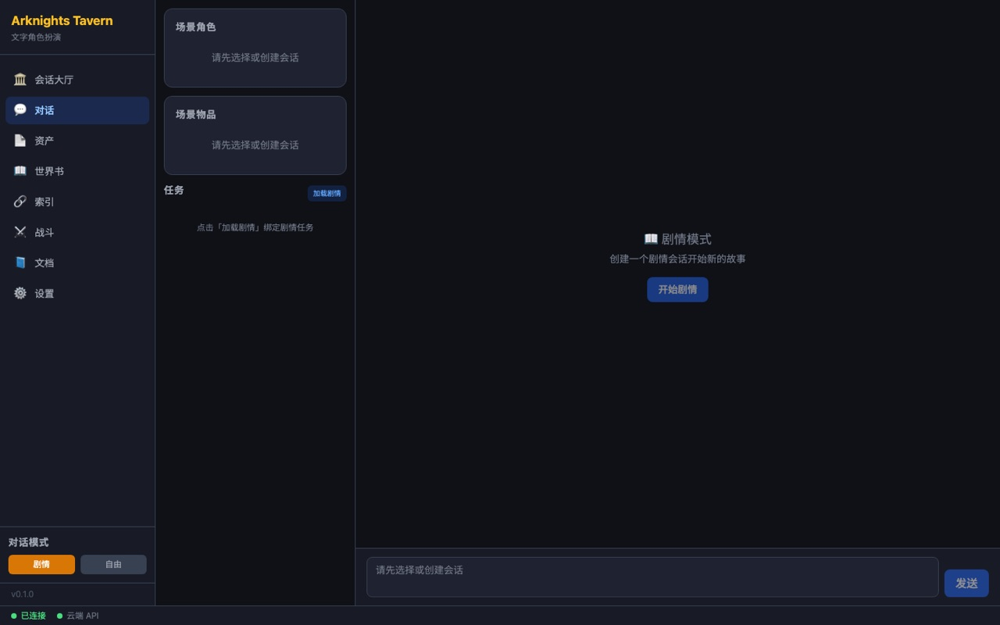
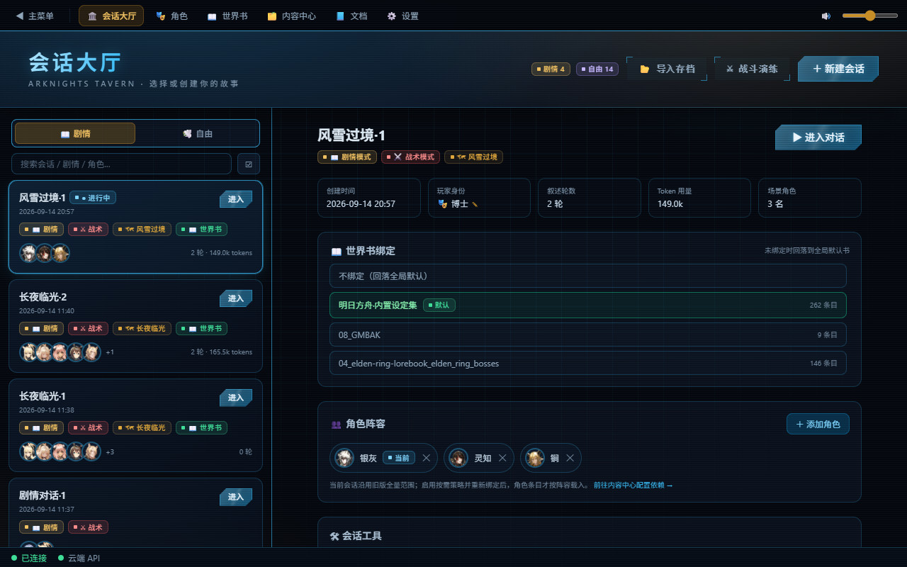
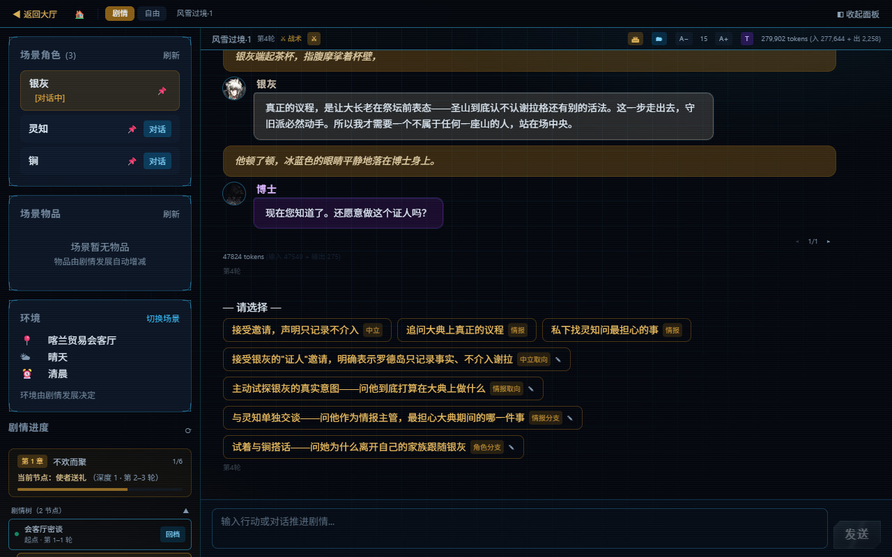
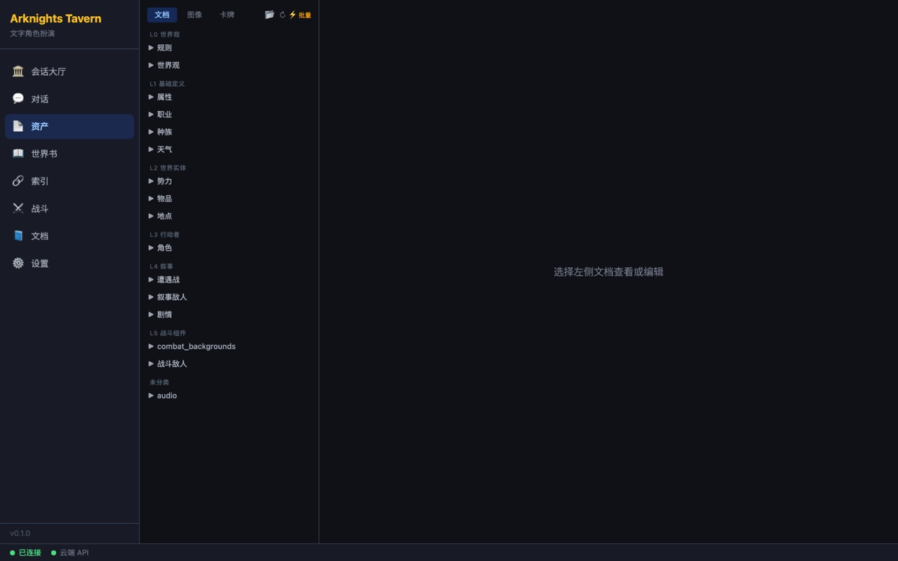
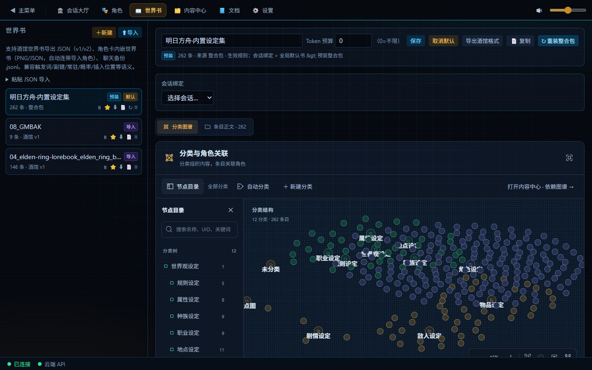
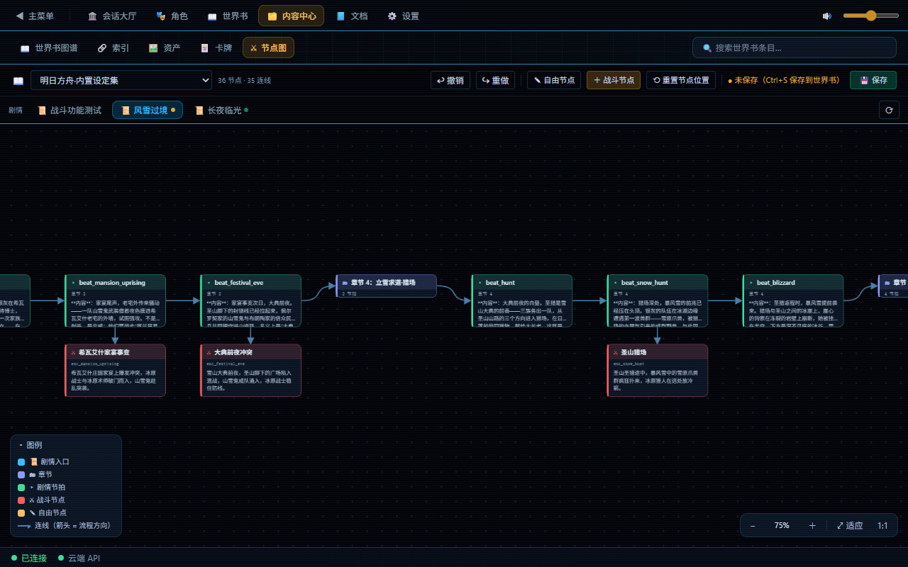
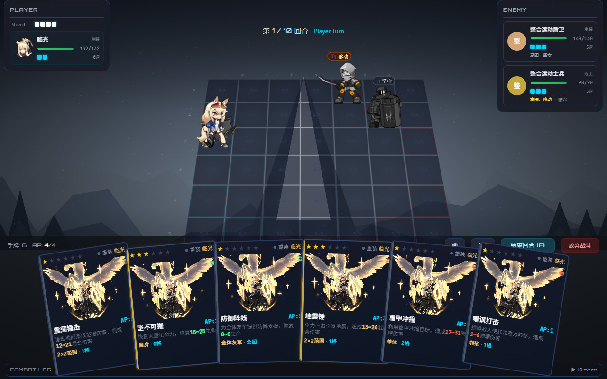
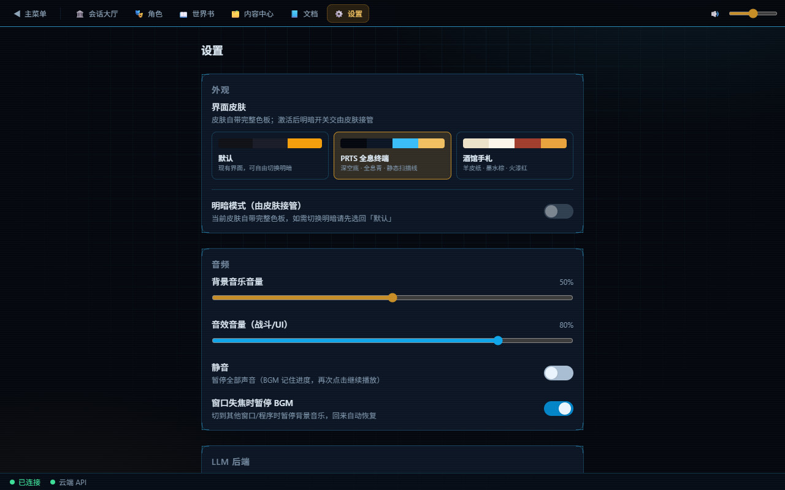

# Arknights Tavern（开发测试中，功能尚未完善）

**一款跑在你自己电脑上的明日方舟主题文字角色扮演游戏。** AI 扮演「主持人」把故事讲下去，你只需要做选择；剧情里遭遇敌人时，可以掏出卡牌在网格战场上打一场回合制战斗。角色、剧情、世界书、战斗数据和存档全部存放在本机。

> 第一次玩？建议先看图文教程 [**docs/tutorial.md**](docs/tutorial.md) —— 从零开始、不需要任何编程知识。

---

## 界面速览

### 主界面

启动后进入主菜单，六个入口覆盖全部功能；底部状态栏实时显示后端连接、AI 模型状态与版本号。



### 会话大厅

每个「会话」就是一份游戏存档。列表按剧情 / 自由分栏，支持搜索、批量删除、绑定世界书、配置角色阵容与存档导入导出；进行中的会话可直接进入战斗。



### 对话界面

剧情模式下 AI 自动推进故事并给出行动选项；每条叙述右下角是版本切换器，每两轮之间有「↩ 回退」按钮，左侧面板底部是自动生成的章节回忆。



### 内容中心

统一管理世界书图谱、索引、资产与卡牌，顶部搜索框可跨世界书条目检索并一键跳转。



### 世界书

酒馆（SillyTavern）Lorebook 兼容的设定库：关键词触发注入、绑定会话、批量编辑，并提供分类结构 / 条目依赖 / 依赖树三种图谱视图。



### 剧情节点图

按「世界书（设定集）→ 剧情」两级选择后，在一张整页画布上编辑剧情节拍与战斗节点，双击节点打开编辑抽屉，支持 `Ctrl+Z` 撤销与 `Ctrl+S` 保存。



### 战斗界面

左侧我方状态、中央网格战场（PixiJS 角色动画与特效）、右侧敌方状态、底部手牌与事件日志。



### 设置

模型配置、皮肤与明暗主题、背景音乐 / 音效音量、剧情叙述选项都在这里。



---

## 功能亮点

- **剧情模式** — AI 自动推进故事线并生成行动选项（可配置生成 1–5 个），你只需在关键时刻做选择。
- **多种「后悔药」** — 轮次回退、回忆回退、编辑自己的消息后重新生成、删除单条消息；同一条叙述还能生成多个版本并随时切换。
- **剧情回忆** — 每隔若干轮自动把进展总结成章节摘要，随时回顾发生过什么，也可一键重新总结。
- **自由模式** — 手动把角色和物品加进场景，与单个角色对话或发起群聊，自由编辑地点 / 天气 / 时间。
- **会话大厅** — 像游戏主菜单一样管理全部存档：新建、切换、重命名、批量删除、导出 / 导入存档包、绑定世界书与角色阵容。
- **回合制网格战斗** — 卡牌 + AP + 地形，网格尺寸由战斗节点定义（内置节点为 7×7），带 CSS 3D 透视与 PixiJS Spine 角色动画、技能特效和音效；数字键 `1-5` 选牌、`F` 结束回合、`Esc` 取消。战斗结束后角色状态自动回写会话。
- **世界书（酒馆兼容）** — 导入酒馆世界书 JSON（v1/v2）、角色卡内嵌世界书、聊天备份 `.jsonl`；支持常驻 / 选择性 / 概率 / 大小写 / 全词匹配等酒馆语义；可绑定到指定会话，并能一键导出回酒馆 v1 格式。
- **世界书图谱** — 分类结构、条目依赖网络、依赖树三种视图，支持批量设为导入源、批量建立 / 清除依赖、批量移入分类。
- **剧情节点图** — 在整页画布上把剧情节拍与战斗节点连成一张图，可视化编排一条完整剧情线。
- **开箱即用的内容** — 随程序分发 181 名角色、27 件物品、20 种敌人、17 个战斗节点与 3 条剧情线（`fengxue_guojing` 风雪过境、`near-light` 长夜临光、`combat-test` 战斗测试），以及方舟设定集世界书整合包（首次启动自动安装）。
- **角色管理** — 浏览角色库、直接导入 SillyTavern 角色卡（`.png` / `.json` / `.webp` / `.jpg`，内嵌世界书一并导入）、维护多个「玩家身份」。
- **云 / 本地模型双后端** — 支持 OpenAI 兼容接口、DeepSeek 与本地 Ollama；可同时配置主备，其中一个不可用时自动切换，对话不中断。
- **桌面端 + 浏览器端** — 同一个前端既能以 Electron 桌面窗口运行，也能用浏览器打开；已配置 Windows（NSIS）/ macOS（DMG）/ Linux（AppImage）打包目标。
- **多套皮肤** — 默认（深色 / 浅色）、PRTS 全息终端、酒馆手札三套界面皮肤，可在设置页一键切换（战斗页保持独立配色）。
- **数据全部在本地** — 会话、记忆、世界书、战斗数据都写在 `data/` 目录；向量记忆检索使用本地 ONNX 嵌入，除调用 LLM 外无需联网，可配合 Ollama 完全离线游玩。

---

## 与同类项目的对比

| 对比维度 | Arknights Tavern | SillyTavern |
| --- | --- | --- |
| 产品定位 | 明日方舟主题的**完整文字 RPG**：剧情推进、回合制战斗、内容库一体 | 通用的 LLM 角色扮演**前端**，以角色卡对话为核心 |
| 开箱内容 | 随程序分发 181 名角色、27 件物品、20 种敌人、17 个战斗节点、3 条剧情线与方舟设定集世界书整合包，装好即可开玩 | 本体不绑定特定世界观，内容依赖用户自行导入角色卡 / 世界书 |
| 剧情能力 | 内置剧情模式：AI 叙述 + 行动选项 + 章节回忆 + 轮次 / 回忆 / 消息级回退 + 叙述多变体；另有整页画布的「剧情节点图」 | 以自由对话为主 |
| 战斗 | 内置卡牌回合制网格战斗：AP、地形、可配置网格、Spine 动画与音效，战后状态回写会话 | 无内置战斗系统 |
| 世界书 | 酒馆 Lorebook v1/v2 兼容（导入 / 导出 / 角色卡内嵌 / `.jsonl` 聊天备份），另有分类结构、条目依赖、依赖树三种图谱视图与批量依赖操作 | 原生 Lorebook，条目管理成熟、社区生态庞大 |
| 内容管理 | 「内容中心」统一管理世界书图谱、索引、资产、卡牌、节点图；资产与卡牌标注来源世界书并可按书筛选 | 以角色卡与世界书为组织单位 |
| 运行形态 | Electron 桌面端（已配置 Windows / macOS / Linux 打包目标）与浏览器端两种界面；后端对话走 SSE 流式输出 | 浏览器访问，Node.js 单运行时 |
| 上手成本 | 提供 Windows / macOS 一键启动脚本（自动检查依赖、清理本项目残留进程、等后端就绪）与零基础图文教程 | 需自行准备运行时并配置模型连接 |
| 依赖与体积 | 需要 **Python 与 Node.js 两套运行时**，首次安装依赖较多 | 单 Node.js 运行时 |
| 数据与隐私 | 会话 / 记忆 / 世界书 / 战斗数据全部落本地 `data/`；向量记忆用本地 ONNX 嵌入并关闭匿名遥测，除调用 LLM 外可离线 | 数据以本地存储为主 |
| 扩展方式 | 直接在界面内编辑世界书条目、卡牌与剧情节点图；战斗内容走规格文件 + 校验 / 试跑工具链 | 依靠第三方扩展（Extensions）生态 |
| 分发状态 | 目前**只能从源码运行**（仓库未提供已发布安装包，也无 CI） | 提供安装脚本与社区维护的分发方式 |

> 说明：上表「Arknights Tavern」一列均可在本仓库中核对（数据量见 `data/`，脚本见 `scripts/` 与 `tools/`，打包目标见 `frontend/package.json`）；「SillyTavern」一列为其公开发布形态的概括，具体请以其官方文档为准。本项目与 SillyTavern 无隶属关系，世界书格式兼容并感谢其社区建立的通用标准。

---

## 快速开始

### 前置条件

| 项目 | 要求 |
| --- | --- |
| 操作系统 | Windows / macOS / Linux |
| Python | 已安装并加入 `PATH`（`requirements.txt` 未锁定版本，开发记录使用 Python 3.12） |
| Node.js | 已安装（含 `npm`） |
| AI 模型 | 一个云端 API Key（OpenAI 兼容或 DeepSeek），或本地 [Ollama](https://ollama.com) |
| 磁盘 | 仓库源码 + Python / Node 依赖 + `data/` 数据目录 |

> 注意：`chromadb` 是必需依赖（向量记忆模块直接导入），不装会启动失败。

### 安装依赖（只需做一次）

```bash
# 后端依赖（在仓库根目录）
pip install -r requirements.txt

# 前端依赖
cd frontend && npm install
```

### 启动游戏

#### 方式 A：一键脚本（推荐）

| 平台 | 命令 |
| --- | --- |
| Windows | 运行 `scripts\restart-win.bat`（或 `powershell -File scripts\restart-win.ps1`） |
| macOS | `bash scripts/restart-mac.sh` |

脚本会自动完成：检查运行环境 → 结束本项目遗留的 Python / Node / Electron 进程 → 启动后端 Flask → 等待后端就绪 → 启动前端并拉起 Electron 游戏窗口。**关闭游戏窗口或按 `Ctrl+C` 即自动清理全部进程**，不会残留。

- Windows 脚本要求先执行过 `cd frontend && npm install`，否则会提示缺少 `frontend\node_modules`。
- macOS 脚本要求仓库根目录存在 `.venv` 虚拟环境（首次使用先执行 `python3 -m venv .venv`）；之后它会自动补装缺失的 Python 依赖与 npm 包。

#### 方式 B：手动启动两个服务

打开两个终端窗口：

```bash
# 窗口 1 —— 后端 API 服务（默认 http://127.0.0.1:5000）
python src/app.py

# 窗口 2 —— 前端（Electron 桌面窗口）
cd frontend && npm run dev
```

只想用浏览器、不想要桌面窗口：

```bash
cd frontend && npm run dev:web   # 然后手动打开 http://localhost:5173
```

> 提示：`npm run dev` 与 `npm run dev:electron` 完全等价，都会拉起 Electron 窗口；浏览器访问始终是 http://localhost:5173（前端不会自动打开浏览器）。两个服务都要保持运行，关掉任意一个游戏都会停止。

### 配置 AI 模型

点击左侧「⚙️ 设置」，在「LLM 配置」区域填写，然后点「测试连接」：

- **云端 API** — 选择接口类型（自动 / OpenAI 兼容 / DeepSeek），填入 API Key、接口地址与模型名称。
- **Ollama 本地** — 先安装 [Ollama](https://ollama.com) 并 `ollama pull qwen2.5:7b`，再填入 Ollama 地址（默认 `http://localhost:11434`）与模型名称。
- **主备切换** — 同时配置云端与本地时，其中一个不可用会自动切换，对话不中断。

> 不配置也能进入界面浏览内容，但对话会返回「LLM 后端不可用」。

### 运行测试（可选，开发者向）

```bash
bash scripts/run_tests.sh          # pytest + tests/legacy/ 脚本式检查
```

Windows 上该脚本默认调用 `python3`，可用 `PYTHON=python bash scripts/run_tests.sh` 指定解释器。

---

## 使用说明

### 1. 创建会话

进入「🏛️ 会话大厅」→「+ 新建」，选择模式：

- **剧情模式** — 导入世界书，体验完整故事线。
- **自由模式** — 与角色自由互动，没有固定剧情。

创建时可选绑定一本世界书、挑选出场角色，并选定战斗模式（`narrative` / `tactical`，**创建后不可更改**）。新建的会话进入全屏沉浸式对话页；要改设定请退回大厅。

### 2. 剧情模式

- **做选择** — 叙述结束后点击下方选项，或直接在输入框打字并回车。
- **回退** — 每两轮之间点「↩ 回退」；展开回忆点「↩ 回退到此」；悬停自己的消息点 `✎` 修改后「保存并继续」。
- **叙述变体** — 叙述右下角 `◂ 1/1 ▸` 切换版本，在最后一个版本再点 `▸` 可输入提示词重新生成。
- **回忆** — 左侧面板底部查看章节摘要，可重新生成；间隔在设置页调整。

### 3. 自由模式

- 从「场景角色」/「场景物品」卡片点「+ 添加」把角色、物品放入场景。
- 点角色旁的「对话」切换当前对话目标；多人在场时可发起群聊。
- 点环境面板「编辑」选择预设地点 / 天气 / 时间，或「✏️ 自定义...」输入任意值。

### 4. 内容中心

顶栏五个 Tab：

| Tab | 用途 |
| --- | --- |
| 📖 世界书图谱 | 节点分类、依赖树与依赖网络、固定导入、导入预览 |
| 🔗 索引 | 文档依赖关系与会话白名单 |
| 🖼️ 资产 | 图片资产上传 / 裁剪 / 设为默认图 / 按来源世界书筛选 |
| 🃏 卡牌 | 角色卡牌与职业卡牌编辑、所属世界书 |
| ⚔ 节点图 | 按设定集选择剧情，整页画布编辑节点图 |

顶部搜索框可跨世界书条目检索，命中后一键跳到「世界书」页。

### 5. 世界书

1. **导入** — 支持酒馆世界书导出 JSON（v1/v2）、角色卡内嵌世界书、聊天备份 `.jsonl`；也可直接粘贴 JSON。程序会自动识别格式并报告导入 / 跳过 / 警告。
2. **触发** — 条目按主 / 副关键词扫描最近对话自动注入；支持常驻、选择性、概率、深度、分组、大小写、全词匹配等酒馆语义。
3. **绑定** — 每本书可绑定到指定会话；未绑定时回落到全局默认书；都没配置时使用预装整合包。
4. **来源** — 预装包（随程序分发，首次启动自动安装）可编辑 / 停用 / 删除 / 一键重装；导入内容自由扩展。
5. **导出** — 一键导出回酒馆 v1 格式，保留 `disable` / `extensions` 等原始字段，可无损回灌。

### 6. 战斗

三种进入方式：对话页顶栏手动触发遭遇战、在会话大厅点「⚔ 战斗演练」进测试战场、或使用无需会话的「战斗测试」模式。

| 操作 | 方法 |
| --- | --- |
| 选择卡牌 | 点击手牌中的卡牌，或按数字键 `1-5` |
| 打出卡牌 | 选中后点击目标格子，或直接拖拽卡牌到目标格子 |
| 移动角色 | 点击我方角色选中，再点击高亮格子 |
| 查看属性 | 点击角色选中，悬停查看属性浮窗 |
| 结束回合 | 点击「结束回合」或按 `F` |
| 取消操作 | 按 `Esc` |

战斗结束后，角色的 HP 变化、受伤、死亡等状态会自动回写到当前会话。

### 7. 设置

- **外观** — 三套皮肤（默认 / PRTS 全息终端 / 酒馆手札）与深色 / 浅色主题（皮肤激活时明暗由皮肤接管）。
- **音频** — 背景音乐音量与音效音量。
- **LLM** — 查看主备后端、切换端点、刷新列表、测试连接、叙述思考档位（作用于叙述与角色对话；选项 / 回忆等分类任务始终关闭思考）。
- **剧情选项** — 自动生成剧情选项、生成选项个数、回忆间隔、每轮目标字数上限、「选项填充到输入框」（开启后点击选项只填入输入框、可编辑再发送）、角色对话以头像气泡展示。

---

## 许可证与致谢

### 许可证

本项目采用 **MIT License**，完整文本见 [LICENSE](LICENSE)。你可以自由使用、修改、分发，包括商业用途，只需保留版权声明与许可声明。

> ⚠️ MIT 授权仅覆盖**本项目自身的代码与原创内容**。随仓库分发的第三方素材（见下）不在 MIT 覆盖范围内，各自适用其原始许可。

### 第三方素材与权利

- 《明日方舟》的世界观、角色与美术素材版权归**鹰角网络（Hypergryph）**所有。本项目是**非官方同人作品**，与官方及其关联方没有任何隶属或授权关系，请勿用于商业用途。
- 美术资源来自 [yuanyan3060/ArknightsGameResource](https://github.com/yuanyan3060/ArknightsGameResource) 与 [fexli/ArknightsResource](https://github.com/fexli/ArknightsResource)（Spine 动画），按各自的仓库许可使用。图片资源目录 `assets/` **不入库**，需自行获取。
- 世界书格式兼容 [SillyTavern](https://github.com/SillyTavern/SillyTavern) 的 Lorebook，并支持导入其角色卡与聊天备份 —— 感谢其社区建立的通用格式。
- 本地模型推理参考 [Ollama](https://ollama.com)。
- 运行所依赖的开源组件见 `requirements.txt` 与 `frontend/package.json`。

---

## 开发者文档

面向最终用户的内容到这里就结束了。以下内容面向开发者与内容作者：

| 文档 | 内容 |
| --- | --- |
| [`AGENTS.md`](AGENTS.md) | 仓库工作流、分支约定与关键约束 |
| [`docs/architecture.md`](docs/architecture.md) | 系统架构、模块职责、数据位置 |
| [`docs/battle-spec.md`](docs/battle-spec.md) | 战斗节点 JSON 规格 |
| [`docs/combat-ui-design.md`](docs/combat-ui-design.md) | 战斗界面设计 |
| [`docs/content-hub-design.md`](docs/content-hub-design.md) | 内容中心设计 |
| [`docs/combat-background-prompts.md`](docs/combat-background-prompts.md) | 战斗背景图生成提示词 |

---

