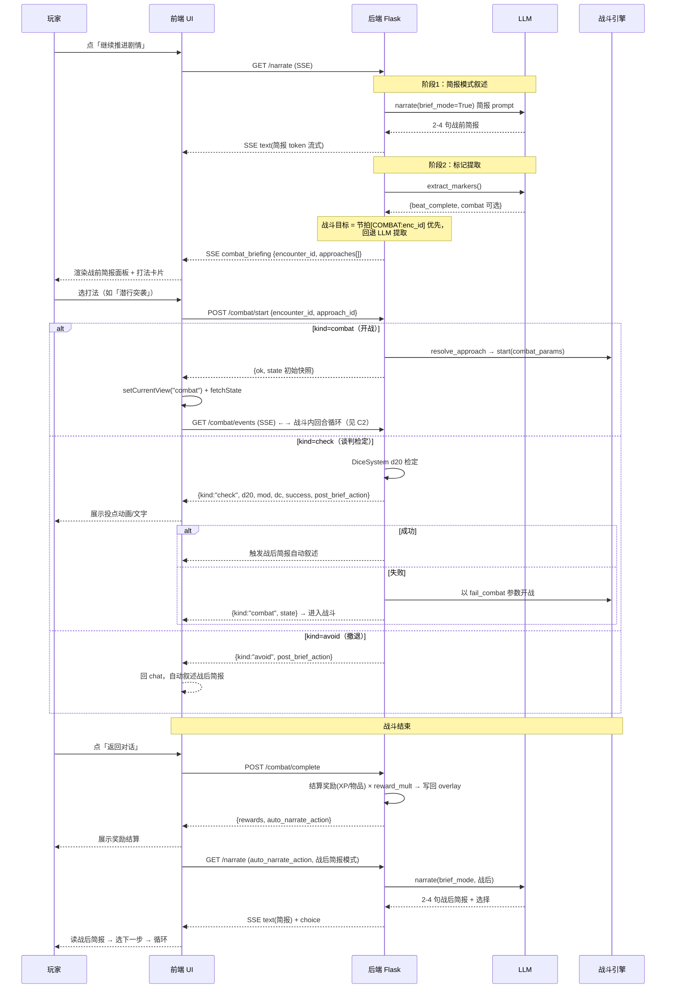
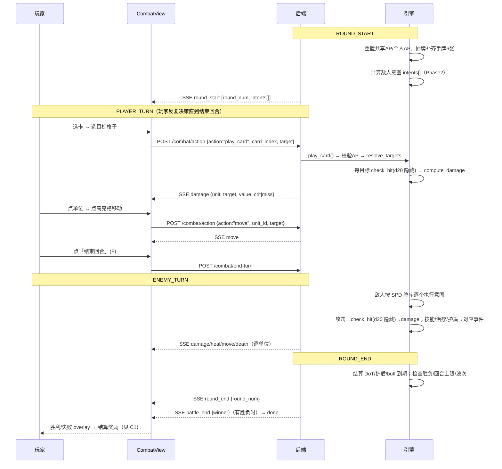

# 章节战斗化改造方案（战斗为主体 · LLM 简报化）

> 定位：在**保持现有战斗形式不变**的前提下，把游戏从「LLM 主导叙事」重构为「战斗为主体、LLM 只做战前/战后简报」的章节式玩法，并系统性加深战斗策略深度。
>
> 状态：**设计文档（待审阅）**。阅读确认后再进入实现阶段。

---

## Part A　整体方案总结

### A1. 背景与问题

当前核心循环 = 玩家 1 次操作（点选项/打字）→ LLM 生成 ~500 字叙述 → 等待 → 新选项。**操作密度极低（每轮 1 次点击）、叙述质量不可控**，玩家只是旁观 LLM 演出 → 无聊。

### A2. 改造方向（已确认）

1. **战斗成为主体体验**，核心循环是一场接一场的战斗，叙述只做"胶水"。
2. **LLM 只做战前简报 + 战后简报**（各 2-4 句：为什么打 / 和谁打 / 为何而战 / 结果与影响）。短输出 = 质量稳定。
3. **玩家选择真实影响战斗**：战前"打法选择"映射机械参数（敌人数/先手/属性修正/奖励倍率）。
4. **骰子双层**：战斗内 d20 作为底层命中/伤害判定（**隐藏不展示**）；仅在**重要剧情分支抉择**时展示投点（骰面 + 修正 + DC + 成败）。
5. **章节形式不变**：保留章节/节拍结构，节拍内 `[COMBAT:enc_id]` 改由**代码确定性解析**，章节战斗可控可脚本。
6. **战斗形式保持不变**：7×7 网格卡牌战斗骨架不改，设计上丰富深度。

### A3. 目标核心循环

```
章节节拍
  → [战前简报] LLM 2-4 句：冲突缘起、双方是谁、为何而战
  → [打法选择] 玩家从遭遇定义的 approaches 选一个（映射机械参数）
        ├─ 开战类 → [战术战斗]（主体，3-5 回合）
        └─ 谈判/撤退类 → [剧情投点展示] d20 检定 → 避免战斗 或 强制开战
  → [战果结算] 奖励（XP/物品/卡牌）× 打法倍率 + 战果写回章节
  → [战后简报] LLM 2-4 句：结果 + 对章节的影响 + 去向
  → 叙事选择（短）→ 决定下一场遭遇 → 循环
```

**节奏目标**：单场战斗 2-4 分钟，战斗间隔只留 1-2 段短叙述 + 1 个选择，战斗时间占比 > 70%。

### A4. 架构改动总览（文件清单）

| 层 | 文件 | 改动 |
|---|---|---|
| 数据 | `data/combat/encounters/*.md` | 新增 `approaches:` 打法定义段 |
| 后端 | `src/session_overlay.py` | 节拍解析 `[COMBAT:enc_id]` → `combat_id` 字段 |
| 后端 | `src/SceneManager.py` | 简报版 narrator system prompt（`brief_mode`）|
| 后端 | `src/combat_approaches.py`（新）| `resolve_approach()` + 兜底 approaches |
| 后端 | `src/combat_session.py` | `start()` 扩展 `enemy_scale / first_strike / reward_mult` |
| 后端 | `src/blueprints/chat.py` | 两段式战斗触发：发 `combat_briefing` 事件，不再自动开战 |
| 后端 | `src/blueprints/combat.py` | `/start` 支持 `approach_id`；`/complete` 结算奖励 |
| 后端 | `src/combat_data_loader.py` | 新增 `load_enemy_meta()`（取掉落/XP）|
| 前端 | `stores/appStore.ts` | `pendingBriefing` 状态 |
| 前端 | `ChatPanel.tsx` | `onBriefing` 处理器 + 战前简报面板 |
| 前端 | `hooks/useApi` | `combatStart` 支持 `approach_id` |
| 前端 | `CombatView.tsx` | 战后奖励展示 |

### A5. 阶段规划

- **Phase 1（MVP · 章节战斗化闭环）**：A4 全部清单 + 谈判/撤退剧情投点 + 奖励结算。
- **Phase 2（深度化）**：敌人意图预判、状态效果实装、卡组构建、SPD 行动顺序、波次/条件生效。
- **Phase 3（进阶）**：遗物、干员士气、指挥官模式、战斗内 LLM 插话（可选）、重养成系统。

---

## Part B　战斗系统设计

### B1. 保持不变的骨架（明确不改动）

7×7 网格、4 人小队、共享手牌 6 张、共享 AP + 个人 AP、d20 命中/伤害/暴击、卡牌三堆（deck/hand/discard/exhaust，Slay the Spire 式）、SSE 事件流、现有 CombatView UI（3D 网格 + Spine 小人 + 拖卡攻击箭头）。

### B2. 单场战斗流程与回合结构（深化版）

**流程**：
```
进入战斗（简报已完成、打法已选定）
  → 部署阶段（MVP 沿用默认位置）
  → 回合循环（目标 3-5 回合）
  → 胜负判定 → 战果结算 → 返回章节
```

**回合状态机**（沿用现有 `INIT → ROUND_START → PLAYER_TURN → ENEMY_TURN → ROUND_END → END`，深化各阶段职责）：

| 阶段 | 现状 | 深化后 |
|---|---|---|
| **ROUND_START** | 重置 AP | 重置 AP + 计算**敌人意图** + 结算持续效果（DoT/护盾）|
| **PLAYER_TURN** | 出牌/移动/结束 | 增加「坚守」姿态（不行动，下回合 +AP）、读意图后再决策 |
| **ENEMY_TURN** | 全部敌人按 dict 顺序贪心行动 | 敌人按 **SPD 排序逐个执行意图**（移动/攻击/技能）|
| **ROUND_END** | 推进回合 | 结算 buff/debuff 到期、检查 `max_rounds`/逃跑/波次触发 |

### B3. 决策空间（每回合玩家要做的决定）

1. **AP 分配**：共享 AP（出牌）vs 个人 AP（移动）；是否保留 AP 下回合（「蓄力」）。
2. **卡牌取舍**：手牌 6 张打哪几张、打谁、什么位置（AOE 角度/射程/目标过滤）。
3. **位置价值**：卡位保护后排、进入敌人射程、触发「掩护」拦截。
4. **意图应对**：读到敌人意图后选择集火打断 / 拉开距离 / 开护盾。
5. **资源长线**：精英卡会消耗（exhaust），是否在本场/关键战使用。

深度杠杆优先级：**意图预判 > 状态效果 > 卡组构建 > 行动顺序 > 波次条件**。

### B4. 骰子系统（双层）

**战斗内（底层 · 隐藏）**：沿用 `src/combat_engine/dice.py`。
- 命中：`d20 + 命中 vs 10 + 闪避`；自然 20 = 暴击 ×2、自然 1 = 必失。
- 伤害：`random(min,max) + 攻击×倍率 − 抗性`（物理减 DEF、法术减 RES）。
- **展示规则**：战斗内**不展示投点**，只展示结果（伤害数字/miss/暴击）。保持节奏流畅。

**剧情分支（戏剧化 · 展示）**：唯一展示投点的地方，复用 `src/services/dice.py` 的 `DiceSystem`。
- **触发点**：战前打法中的谈判类选项、章节关键抉择、战后果断（追击/撤退/谈判遗产）。
- **展示内容**：`d20 骰面 + 属性修正 vs DC`，大成功(20)/大失败(1)，成败后果。SSE `dice_check` 事件 → 前端展示。
- **机制**：属性从角色 metadata 读取（与 `AttributeRollHook` 同源）；失败 = fail-forward（带代价继续），不 GAME OVER。

> 设计意图：战斗内的骰子负责"不可预期"，剧情分支的骰子负责"戏剧性"。玩家只在最有 stakes 的时刻看到骰子滚动。

### B5. 战前打法（Approach）与机制映射

**数据定义**（`data/combat/encounters/*.md` 新增前元数据段）：

```yaml
approaches:
  - id: assault
    label: "正面强攻"
    hint: "以绝对火力压制，敌人不会增援，但全力迎战。"
    combat: { enemy_scale: 1.0, first_strike: false, player_effects: {}, reward_mult: 1.2 }
  - id: ambush
    label: "潜行突袭"
    hint: "绕后突袭抢占先手；若惊动敌人将陷入苦战。"
    combat: { enemy_scale: 0.8, first_strike: true, player_effects: {}, reward_mult: 1.0 }
  - id: negotiate
    label: "尝试谈判"
    hint: "以交涉化解冲突，骰点决定成败。"
    check: { dc: 12, attr: "魅力" }
    fail_combat: { enemy_scale: 1.2, player_effects: {博士: {hp_penalty: 0.1}}, reward_mult: 0.7 }
    reward_mult: 0.5
  - id: retreat
    label: "撤退"
    hint: "保全队伍，放弃本次战利品。"
    avoid: true
    reward_mult: 0.0
```

**机制映射**：`resolve_approach(encounter, approach_id)` 返回 `{kind: "combat"|"check"|"avoid", combat_params}`。

| kind | 行为 | 参数 |
|---|---|---|
| `combat` | 直接开战 | `enemy_scale`（敌人数倍率）、`first_strike`（首回合共享 AP+1）、`player_effects`（复用 status_effects）、`reward_mult` |
| `check` | 剧情投点（展示 d20）| 成功 → 避免战斗 + 部分奖励 + 战后简报；失败 → 以 `fail_combat` 参数强制开战 |
| `avoid` | 直接跳过战斗 | 战后简报 + 无奖励（或微量）|

**可靠性设计**：approaches 定义在代码侧数据（平衡、可预期），LLM 只负责在简报里用叙述引出，不决定机制；遭遇未定义 approaches 时用兜底 `[强攻, 撤退]`；**选定打法后才通过 POST `/combat/start` 启动**，不再由 LLM 自动开战。

### B6. 深度机制（Phase 2）

1. **敌人意图（Enemy Intent）★ 最高性价比**：ROUND_START 计算每个敌人意图 `{type: 攻击/治疗/护盾/技能, target, 强度范围}`，前端头顶图标展示；敌人 AI 从贪心升级为模式化（`ai_skills` 数据已存在未实现）。
2. **状态效果实装**：现有大量卡牌描述（防御/拦截/减速/增益）只是文案、引擎只做伤害/治疗。实装 `status_effects` 运行时表，卡牌声明 `apply: {effect}`。可对接 `data/rules/buff-pool/`、`debuff-system/`。
3. **卡组构建 ★ 长线深度**：战后 1 选 1「抽新卡 / 删卡 / 强化卡」，卡组战役内持久，跨场次成长。
4. **行动顺序**：敌人阶段按 SPD 降序逐个行动（现有 SPD 属性未被使用）。
5. **波次与条件生效**：落实数据里已定义但引擎未读取的 `max_rounds`（超时判退/判负）、`escape_enabled`、波次触发。
6. **Phase 3 备选**：遗物、干员士气、卡牌稀有度/升级树、指挥官模式。

### B7. 战后奖励与成长

- **奖励结算**（打通现有缺口）：XP = `Σ 敌人.xp_reward × 遭遇rewards.xp × approach.reward_mult`；物品 = 遭遇 `rewards.items` + 按 `drop_rate` roll 敌人 `drop_items`；卡牌奖励（B6-3）1 选 1。结算写入 `session.overlay.combat_history` + 累积角色 XP。
- **成长（轻量）**：XP 阈值 → 等级 → 属性 +1（复用 8 维属性 → 战斗数值公式）。重养成留 Phase 3。
- **战果影响章节**：胜负 + 谁幸存 + 战利品写入章节状态，影响后续节拍；失败向前（战败 = 撤退/带伤继续，不 GAME OVER）。

### B8. LLM 集成边界（明确不越界）

| 场景 | LLM 角色 | 长度 | 越界（禁止） |
|---|---|---|---|
| 战前简报 | 交代冲突缘起、双方、为何而战、局势 | 2-4 句 | 不展开叙述、不代玩家决策、不决定遭遇 |
| 战后简报 | 结果 + 对章节影响 + 去向 | 2-4 句 | 不裁决战斗结果 |
| 剧情分支投点 | 叙述投点前因后果 | 1-2 句 | 不参与骰面/DC 计算 |
| 叙事选择 | 生成下一节拍选择标签 | ≤15 字/项 | 不生成机械参数 |
| 战斗内 | **不介入**（Phase 3 可选：非阻塞逐回合插话）| — | 不阻塞战斗流程 |

**机制边界**：战斗的胜负、命中、伤害、奖励全部由引擎/数据决定，LLM 永远只做"描述"。

---

## Part C　战斗系统详细流程说明（重点）

### C1. 端到端时序（章节节拍 → 战斗 → 回章节）



### C2. 战斗内回合时序



### C3. SSE 事件序列

**叙述流（战前简报模式）** `GET /narrate`：
```
data: {"type":"meta", "data":{"stream_id":"narr_xxx"}}
data: {"type":"text", "data":{"token":"…"}}          ← 简报 2-4 句逐 token
data: {"type":"combat_briefing", "data":{"encounter_id":"enc_snow_convoy","approaches":[…],"stream_id":"narr_xxx"}}
data: {"type":"choice", "data":{"options":[…], "stream_id":"narr_xxx"}}
data: {"type":"done", "data":{"stream_id":"narr_xxx"}}
```

**战斗流** `GET /combat/events`：
```
data: {"type":"round_start", "data":{"round":1, "intents":[…]}}
data: {"type":"damage", "data":{"unit_id":"…","target":[3,4],"value":18,"crit":true}}
data: {"type":"heal"|"move"|"death", …}
data: {"type":"round_end", "data":{"round":1}}
…（反复）…
data: {"type":"battle_end", "data":{"winner":"player","rounds":4}}
data: {"type":"done"}
```

**剧情投点**（谈判类 approach，POST 响应内联返回，可选同时推 SSE）：
```
{"kind":"check", "check":{"attr":"魅力","d20":15,"mod":2,"dc":12,"success":true},
 "post_brief_action":"谈判成功，敌军退却…"}
```

### C4. 接口与数据流

| 接口 | 方法 | 入参 | 出参 |
|---|---|---|---|
| `/api/sessions/{id}/narrate` | GET SSE | `action`, `identity` | `meta/text/combat_briefing/choice/done` |
| `/api/sessions/{id}/combat/start` | POST | `{encounter_id, approach_id}` | `{ok, kind, state\|check\|post_brief_action}` |
| `/api/sessions/{id}/combat/state` | GET | — | 全量战斗快照 |
| `/api/sessions/{id}/combat/action` | POST | `{action: play_card\|move, card_index\|unit_id, target}` | `{ok, state}` |
| `/api/sessions/{id}/combat/end-turn` | POST | — | `{ok, state}` |
| `/api/sessions/{id}/combat/events` | GET SSE | — | `round_start/damage/heal/move/death/round_end/battle_end/done` |
| `/api/sessions/{id}/combat/complete` | POST | — | `{ok, rewards:{xp, items, cards}, auto_narrate_action}` |
| `/api/sessions/{id}/combat/abandon` | POST | — | `{ok, auto_narrate_action}` |

**状态机流转**（战斗内）：`INIT → ROUND_START → PLAYER_TURN → (玩家 action×n / end-turn) → ENEMY_TURN → ROUND_END → (无胜负则) ROUND_START … → 有胜负 → END`。玩家操作在非 `PLAYER_TURN` 阶段一律被拒绝。

### C5. 玩家视角逐步流程

1. **章节界面**：读到 1-2 段短叙述 + 一个叙事选择（决定去哪个节拍）。
2. **战前简报**：读到 2-4 句「为什么打、和谁打、为何而战」，下方出现**打法卡片**（label/hint/后果提示）。
3. **选打法**：点卡片。
   - 开战类 → 直接进入战斗界面。
   - 谈判类 → 看到 d20 投点展示（骰面+修正+DC），成功→回章节看后果；失败→带着惩罚进入战斗。
4. **战斗内**（主体体验）：看手牌、看敌人、读敌人意图（Phase2）；每回合——规划 AP → 出牌/移动 → 结束回合 → 看敌人逐单位行动；3-5 回合分出胜负。
5. **战果结算**：胜利/失败 overlay → 看到 XP/物品/卡牌奖励。
6. **战后简报**：回到章节，读到 2-4 句结果与影响 → 选下一步 → 进入下一场。

### C6. LLM 介入点与数据流

| 介入点 | 触发时机 | 输入 | 输出 | 异步性 |
|---|---|---|---|---|
| 战前简报 | 节拍推进、确定战斗目标前 | 章节上下文 + 遭遇概要 + 节拍内容 | 2-4 句文本（`brief_mode`）| 阻塞（流式）|
| 标记提取 | 简报之后 | 简报文本 | `{beat_complete, combat}` | 阻塞 |
| 战后简报 | `/combat/complete` 返回 `auto_narrate_action` 后 | 战果 + 章节上下文 | 2-4 句文本 + 选择 | 阻塞（流式）|
| 叙事选择 | 每段叙述后 | 叙述文本 | 选项数组 ≤15字/项 | 阻塞 |

**性能/体验约束**：战斗内零 LLM 调用；所有 LLM 调用只发生在战斗间隙，且输出极短，玩家等待 < 数秒。

---

## Part D　关键复用与数据格式

### D1. 关键复用清单

- `_apply_status_effects` / `_clamp_penalty` / `_clamp_bonus`（`combat_session.py:187`）— approach 的 `player_effects` 直接走这条既有通道。
- `DiceSystem`（`src/services/dice.py`）— 剧情分支投点。
- `_build_choices` / `_should_extract_markers` / `_apply_beat_complete`（`chat.py`）— 两段式触发只改 combat 段。
- 遭遇/敌人加载（`CombatDataLoader`）— 仅补 `load_enemy_meta()` 取掉落/XP。
- 节拍解析（`session_overlay.py:1085`）— 已保留 content，补 `combat_id` 提取。
- 战斗 SSE 生成器 `_build_sse_generator`（`combat.py:42`）— 事件通道复用，只加 `round_start/intents` 等字段。

### D2. 数据格式变更

1. 遭遇 frontmatter 新增 `approaches:`（见 B5）。
2. 节拍解析新增 `combat_id`（正则提取 `\[COMBAT:([\w-]+)\]`）。
3. `combat_history` 记录扩展 `rewards: {xp, items, cards}`。
4. （Phase2）敌人意图/`ai_skills` 生效：敌人 frontmatter 的 `ai_skills` 已存在，直接消费。

---

## Part E　验证方式

1. 重启后端（`scripts/restart-win.bat`；注意 Windows 两个坑：5000 端口残留旧进程致 404、`python3` 缺失用 `python`）。
2. 新建 story 会话 `combat_mode=tactical`、plot=`fengxue_guojing`，推进到 `beat_convoy_fight`：
   - 期望：收到 2-4 句战前简报（含 `[COMBAT:enc_snow_convoy]` 场景要素）而非长叙述；随后出现打法卡片，**不再自动进入战斗**。
3. 选「潜行突袭」：期望首回合共享 AP+1、敌人数减少（enemy_scale 0.8）。
4. 选「尝试谈判」：期望展示 d20 投点，成功跳过战斗 / 失败以惩罚参数强制开战。
5. 打完战斗 →「返回对话」：期望结算显示 XP/物品，随后 2-4 句战后简报 → 下一节拍。
6. 回归：narrative 模式行为不变；⚔ 手动开战仍可用（兜底 approaches）。
