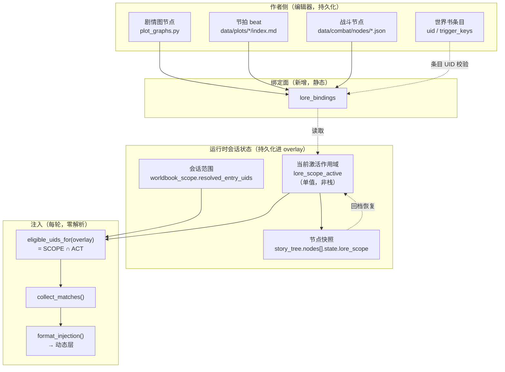

# 节点级世界书动态载入 — 技术方案

> 目标：把「整本世界书常驻注入」改成「会话走到哪个节点，才把该节点绑定的条目放进候选集」，
> 从而削减常驻 Token 与生成干扰，同时保证回档、分支、重入等场景下条目集合可预测、可复现。
>
> 本文档基于当前代码（`src/world_book.py` / `src/session_overlay.py` / `src/combat_nodes.py` /
> `src/blueprints/chat.py` 等）写成，所有结论都标注了落点文件与行号，可直接据此提单。
> 现状与本文档冲突时，以代码现状为准。
>
> **v2 修订**：核对代码后修正了若干事实与两处设计缺陷，见文末修订记录。

---

## 0. 结论速览（TL;DR）

| 议题 | 推荐结论 |
|---|---|
| 绑定方式 | **节点直接引用条目 UID（显式绑定）为基座**，叠加「世界书侧关系图（`graph["related_edges"]`）自动展开」做作者体验兜底；**不引入**新的关键词二次触发、不引入标签批次绑定（标签只作为编辑器批量**工具**，落盘仍是 UID 列表） |
| 载入时机 | **轮末 `commit_tree_step` 一次性解析并冻结**（`advance_beat`/`jump_to_beat` 在轮末先于它执行，快照拍到的就是新节拍，天然同帧）；**回档从节点快照整体还原**；注入时**零解析**（只做集合交集） |
| 默认生命周期 | **路径粘滞（path-sticky）**：进入节点 → 载入；沿当前路径向下 → 保留；回档到引入节点之前 → 自动卸载。`sticky` 是 **target 级**属性，同一节点可混合 sticky / 非 sticky 绑定 |
| 卸载机制 | **不物理删条目，改「窄化白名单」**：候选集 = 会话范围 ∩ 节点作用域，作用域随快照走，回档即天然复原 |
| 注入层级 | 节点载入条目**一律进动态层**（`position != 0 or not always_active` 的既有分支），**绝不进稳定层**，否则每次节点切换都会打碎 API 前缀缓存 |
| 触发与位置 | 绑定默认只**解锁候选资格**（仍需关键词命中）；target 可设 `inject:"always"` **到达即注入**动态层、`inject_position` **按节点覆盖** position/depth/group_weight（就近原则，且永远落不进稳定层） |
| 优先级，冲突 | 同一条目被多个节点载入是**正常态不是冲突**。`dormant_uids` 是**书级**的"默认休眠"，任何 target 把它显式写进 `entry_uids` 即当场解禁 |
| 幂等性 | 冻结作用域内存 `bindings_fingerprint`（= 绑定条目的 `content_revision`）+ 求解器版本号；指纹未变 → 重入/同节点多轮直接复用，不重算 |
| 兼容性 | **默认关闭**：书内没有 `lore_bindings` 条目 → `_active_lore_scope` 恒为 `None`，注入行为与现状**字节不变**；老会话 `worldbook_scope is None` → 走现有 `legacy_full_scope` 全量兼容路径；自由模式（无剧情树）恒为 `None` |

一句话概括实现路线：

> **把现有的「会话级白名单」升级成「会话级白名单 ∩ 节点级作用域」，并把节点级作用域存进剧情树节点的快照里跟着回档一起走。**

---

## 1. 架构设计

### 1.1 现状：三层"节点"与一处缺口

项目里目前有三个彼此独立的"节点"概念，讨论前必须先对齐，否则方案会做错层：

| # | 概念 | 载体 | 是否注入叙事上下文 | 代码位置 |
|---|---|---|---|---|
| A | **剧情图节点**（编辑器布局） | 每个剧情一条世界书条目 `plot_graph_<plot_id>` | **否**（`trigger_keys: []` 且非常驻，明确只服务编辑器） | `src/plot_graphs.py` `encode_graph_for_worldbook` |
| B | **战斗节点** | `data/combat/nodes/<id>.json` | **是**（`trigger_keys = [name, node_id]`，被提及才触发） | `src/combat_nodes.py` `encode_node_for_worldbook` |
| C | **剧情树节点 / 作者节拍** | `overlay._data["story_tree"]["nodes"]` + `beat_state` | 间接（渲染成 `plot_state.md` / `plot_log.md`） | `src/session_overlay.py` |

而"按需载入"要挂的钩子，在 C 上：

- **剧情树节点**（`n_root` + LLM 生成的子节点，`_tree_node_id(parent, label)` 决定复用）——
  分支维度的载体，一个节点 = 一段已发生的剧情；
- **作者节拍**（`beat_state`：`chapter_idx` / `beat_idx` / `completed_beats`）——
  章节维度的载体，`advance_beat()` / `jump_to_beat()` 驱动。
  注意：`beat_state` **不存 beat_id**，beat_id 需由 `(chapter_idx, beat_idx)` 经
  `_ensure_narrative_beats()` 反查（`src/session_overlay.py:681` `_beat_index`）。

**当前的缺口**：世界书的"作用域"机制已经存在，但它是**会话静态**的。

```
src/world_book.py:1187  eligible_uids_for(overlay)
    → 读 overlay.get_worldbook_scope()["resolved_entry_uids"]      # 会话级白名单，全局一套
    → collect_matches(...) 用 eligible_uids 做成员过滤             # src/world_book.py:1216
```

`resolved_entry_uids` 由 `session_scope_snapshot()`（`src/world_book.py:1054`）算一次，
依据是「固定导入 + 剧情世界观 + 出场阵容 + 依赖边展开」，**整个会话生命周期内不变**。
它管的是"这本会话能看见这本书的哪些条目"，而不是"这一刻该看见哪些条目"。
你要的正好是后者。

### 1.2 目标架构：两层作用域 + 单向数据流



三条硬约束：

1. **数据流单向**：作者侧只写绑定面；运行时只读绑定面 + 写激活作用域；注入侧只读激活作用域。
   注入路径上**不允许出现 BFS / 图展开 / 文件 IO**（那些都在节点落盘时做完并冻结）。
2. **激活作用域属于会话数据**，与 `character_states` / `quest_states` / `environment` 同级，
   存进 `overlay._data`，随 `_save()` 落盘。它是**单值**（当前节点的那一份冻结作用域），
   不是栈——历史作用域都在各自节点的快照里，不需要运行时再维护一份。
3. **节点快照必须包含激活作用域**（`_tree_state_snapshot` 现状快照 **8 个键**——
   `round_start` / `round_end` / `narration_round` / `plot_log_len` / `environment` /
   `character_states` / `quest_states` / `beat_state`，
   见 `src/session_overlay.py:977`，**要加第 9 个 `lore_scope`**）。

### 1.3 为什么不复用现有 `eligible_uids_for` 签名改结构

三个候选落点，对比如下：

| 方案 | 做法 | 优 | 劣 | 结论 |
|---|---|---|---|---|
| **① 改 `eligible_uids_for` 内部** | 函数体里读激活作用域，返回 `SCOPE ∩ ACT` | 两个注入点（`SceneManager._build_worldbook_parts:279`、`CharacterAgent:175`）**一处不改**；兜住所有未来调用点 | 调用者看不到"为什么这条没了" | ✅ **推荐** |
| ② 调用点各自算交集 | 在两个注入点各写一遍 `& active` | 显式 | 漏一处就静默失效；`CharacterAgent` 与 `SceneManager` 语义漂移风险高 | ❌ |
| ③ 新增 `node_scope` 参数 | 改签名 `eligible_uids_for(overlay, node_scope=None)` | 最显式 | 要改 2 个调用点 + 全部测试；漏传即退化成旧行为，**静默错误** | ⚠️ 可作为①的补充（调试用） |

选 ①，同时在 ① 里加一个**可观测出口**弥补它的缺点：

```python
# src/world_book.py
def eligible_uids_for(self, overlay, *, with_reasons: bool = False):
    scope = getattr(overlay, "get_worldbook_scope", lambda: None)()
    if scope is None:
        ...  # 现状：legacy 全量兼容快照，一行不改
        # 注意：overlay 无 set_worldbook_scope 时现状返回 None，
        # collect_matches 对 eligible_uids=None 不过滤 —— 该语义必须保留。
    base = set(scope.get("resolved_entry_uids", [])) if scope.get("book_id") == self.id else set()
    node_scope = _active_lore_scope(overlay, self.id)   # 新；无绑定/自由模式/老会话 → None
    if node_scope is None:
        return base if not with_reasons else (base, {"node_scope": None})
    allowed = base & set(node_scope["allowed"])
    if not with_reasons:
        return allowed
    return allowed, {
        "node_id": node_scope["node_id"],
        # 仅为调试/编辑器解释，注入路径不构造（with_reasons=False 时零成本）
        "dropped_by_scope": sorted(base - allowed),
        "missing_uids": sorted(set(node_scope["allowed"]) - base),
    }
```

`_active_lore_scope` 返回 `None` 的三种情形（**默认关闭原则**，详见 §5.5）：
书内无 `lore_bindings` 条目、会话无剧情树（自由模式）、老会话未显式升级。
任一情形下注入行为与现状字节一致。

---

## 2. 绑定机制

### 2.1 四种候选对比

| 方案 | 语义 | 优 | 劣 | 适合做 |
|---|---|---|---|---|
| **A. 节点直接引用 UID** | `{"entry_uids": ["uid1", "uid2"]}` | 意图精确、可静态校验、写入即生效、无隐式行为 | 作者要手动挑条目，条目改名/重建后 UID 断裂 | ✅ **基座** |
| **B. 关键词二次触发** | 节点触发时把该节点的 `trigger_keys` 丢给世界书再匹配 | 复用现有 `_entry_matches` | ① 与现有触发流程**语义重叠**，会出现"节点已到但关键词没出现 → 条目仍不载入"的二级不确定性；② 无法预测 Token 预算；③ 调试成本高（两个变量：到没到节点、提没提到词） | ❌ 不做 |
| **C. 标签/分类批量绑定** | 节点标 `tags: ["风雪过境","谢拉格"]` → 展开成所有该类条目 | 作者省事、新增条目自动纳入 | ① 不可预测（世界书增删会偷偷改变已跑会话的注入）；② 无法表达"只要这一条不要那条"；③ 与"会话范围不随世界书变更而漂移"的既有纪律（`refresh_session_scope`，`src/world_book.py:1117`）冲突 | ⚠️ 只做**编辑器批量工具**，落盘仍是 UID |
| **D. 关系图展开** | 复用 `graph["related_edges"]` 从节点引用的根条目 BFS 带出邻居 | 与现有依赖机制同构、少写一堆 UID | 展开结果受世界书侧编辑影响 → 会话不可复现 | ⚠️ 作为 A 的**可选糖**，且展开结果**在节点落盘时冻结** |

### 2.2 推荐：A 为基座 + D 为可选糖 + C 只做工具

**落盘格式**（世界书侧，与 `plot_graphs` / `combat_nodes` 同一套"围栏 JSON + raw.extensions 标记"模式，保证无损往返）：

```jsonc
// 世界书条目 content
// ```json arknights_tavern_lore_bindings
// { ... 见下 ... }
// ```
```

```jsonc
{
  "schema_version": 1,
  "book_id": "arknights",
  "//": "键 = 绑定目标，值 = 该目标激活的条目；sticky 是 target 级属性，默认 true",
  "targets": {
    // ① 剧情树节点：根节点由 init_story_tree 播种，id 固定 n_root；
    //    子节点是 LLM 生成的，id 是 sha1(parent|label) 派生的 hash，
    //    作者无法预知 → 所以此处只绑 n_root，其余走 beat / chapter 继承（见 §2.3）
    "tree:n_root": {
      "entry_uids": ["uid_lore_worldview_core"],
      "sticky": true,                       // 默认 true：路径粘滞
      "expand": {"depth": 1, "relation": "related"}
    },

    // ② 作者节拍：最稳定的绑定面（人为命名，形如 beat_arrival，非序号）
    "beat:beat_arrival": {
      "entry_uids": ["uid_lore_xielage_geo", "uid_lore_saintess"],
      "sticky": true
    },

    // ③ 章节：整章共用一批背景（key 用章节标题，不用序号，见附录 B 的 0起/1起坑）
    "chapter:fengxue_guojing#不欢而聚": {
      "entry_uids": ["uid_lore_fengxue_arc"],
      "sticky": true
    },

    // ④ 战斗节点：复用 node_id；时机语义见 §4.1 的 combat_id_hint
    "combat:enc_snow_ambush": {
      "entry_uids": ["uid_lore_snowdemon"],
      "sticky": false,                      // 战斗结束后的下一个叙事节点落盘时卸载
      "inject": "always",                   // 到达即注入（绕过关键词/掷骰），见下「触发与位置」
      "inject_position": {"position": 1, "group_weight": 5}   // 本 target 内的位置覆盖
    }
  },
  // 书级"默认休眠"：即便被继承/展开带入也不载入；
  // 任何 target 把它显式写进 entry_uids 即视为当场解禁（用于"这段剧情里他就是个路人"的反面：
  // 某节点确实需要临时用一下原本休眠的条目时，不需要改两份数据）
  "dormant_uids": ["uid_lore_spoiler_reveal_x"]
}
```

**绑定条目自身的约束**（编码器强制 + 校验器报错）：

- 每本书**至多一条** `lore_bindings` 条目。多于一条 → `validate_bindings()` 报错；
  运行时若仍遇到多条，取第一条并告警（不对作者静默合并）。
- 绑定条目本身**永不进注入**：编码器强制 `always_active=false`、`trigger_keys=[]`、
  `selective=false`（无触发键且非常驻的条目在 `_entry_matches` 下天然不命中，
  这里再显式钉死，防止编辑器误改）。
- `targets[*].entry_uids` 不允许引用绑定条目自身的 uid（校验器检查）。
- `validate_bindings()` 逐 uid 检查「存在且 `enabled` 且 `content` 非空」，
  口径对齐 `resolve_import_scope`（`src/world_book.py:876`）。

**触发与位置：两个可选 target 字段**（v2.1 新增，回答"到达节点能否保证条目出现、
能否按节点自由定位置"）：

- `"inject": "match"`（**默认**）：条目只进候选集，仍按现状走关键词命中
  （`_entry_matches`）与 `probability` 掷骰——绑定 = 解锁资格。
- `"inject": "always"`：**到达即注入**。该 target 的条目进冻结作用域的 `pinned`
  集合，注入时跳过 `_entry_matches` 与掷骰，但仍受 `budget_tokens` 截断、
  仍进动态层。适用于战斗机制说明、关键场景设定这类"到了就必须在"的条目。
  注意这**不等于** `always_active`：前者是"节点作用域内钉进动态层"，
  后者是"全书常驻稳定层"，层级纪律不变。
- `"inject_position": {"position": int, "depth": int, "group_weight": int}`：
  per-target 的位置覆盖（均可单独省略，缺省用条目自身值），冻结进作用域的
  `overrides: {uid: {...}}`。注入排序/分层时用覆盖值代替条目原值。
  **约束**（校验器强制）：绑定条目不允许落入稳定层——
  覆盖后 `position == 0` 且条目 `always_active=true` 的组合直接拒绝
  （条目 `always_active=true` 本来就该在 §4.3 的校验里被拒，这里是双保险）。
  同一条目被多个 target 覆盖时**就近原则**：当前节点命中的 target 优先于
  祖先继承的（与 `dormant` 的显式解禁规则同构）。

**运行时叠加规则**（节点落盘时求值一次）：

```
inherited = ∪ 祖先链上各节点冻结作用域里的 sticky_uids        # 路径粘滞的载体
explicit  = ∪ 当前节点命中的各 targets[*].entry_uids           # 过滤 known/enabled
expanded  = ∪ 各 targets[*].expand 在当时关系图上的 BFS 结果    # 冻结，不再漂移
allowed   = (inherited ∪ explicit ∪ expanded) − dormant_uids
            ∪ (explicit ∩ dormant_uids)                       # 显式写名 = 当场解禁
sticky_uids = (explicit ∪ expanded) 中来自 sticky=true target 的部分   # 后代只继承这个
pinned    = explicit 中来自 inject="always" target 的部分      # 注入时绕过关键词/掷骰
            ∪ 祖先 pinned 中仍 sticky 的部分（随 sticky_uids 一起下传）
overrides = {uid: inject_position}，同一条目多处覆盖时就近（当前节点 > 祖先）
```

注意 `dormant` 的语义是**默认休眠**，而不是**永久封印**；且它是**书级**的，
不分节点（v1 不做 per-target dormant，需要局部排除时用 sticky=false 控制传播范围即可）。

### 2.3 绑定到哪一层最合适：三种目标的分工

**问题**：剧情树节点是 LLM 生成的，`_tree_node_id(parent_id, label)` 由
`sha1(parent|label)[:10]` 决定（`src/session_overlay.py:903`）。作者的绑定文件**不可能预先知道**
这些 hash。所以"绑定到剧情树节点"这条路对 LLM 生成节点是**天然不可能**的。

**结论：绑定面必须挂在"作者可命名"的对象上**，然后把作用域**继承**到 LLM 生成节点：

| 绑定目标 | 可命名性 | 稳定性 | 承担什么 |
|---|---|---|---|
| `tree:n_root` | ✅ 固定 | ✅ | 开篇常驻的那一小撮 |
| `beat:beat_*` | ✅ 作者命名 | ✅ | **主力**：这一拍发生的剧情需要的设定 |
| `chapter:<plot_id>#<章节标题>` | ✅ | ⚠️ 标题改名即断（校验器兜底） | 整章共享背景 |
| `combat:<node_id>` | ✅ | ✅ | 战斗相关（敌人、地形、机制）；时机见 §4.1 |
| `tree:n_<hash>` | ❌ LLM 生成 | ❌ 换措辞即变 hash | **不绑**（仅允许运行期由 UI 手挂，见 §6.4） |

**继承语义**（关键，决定 §5 分支跳转的正确性）：

```
节点的有效作用域 = f(节点所属 beat, 节点所属 chapter, 该轮触发战斗的 combat_id,
                     祖先链上所有节点的 sticky_uids)
```

即：**树节点从"它落盘那一刻的 beat / chapter / combat"继承作用域**。
这是可行的，因为轮末的执行顺序是固定的（已核对 `src/blueprints/chat.py:520-597`）：
`_apply_beat_complete`（→ `advance_beat` / `jump_to_beat`，推进 beat_state）
**先于** `_commit_tree_step` 执行，所以 `_tree_state_snapshot` 拍到的
`beat_state` 就是新节拍——两者天然同帧，不需要额外同步机制。

### 2.4 编辑器侧：标签只做"批量勾选"工具

方案 C 的正确形态不是运行时机制，而是编辑器交互：

```
[剧情图节点] 选中 → 侧栏「设定」页签
  ├─ 搜索框   (按条目名 / trigger_keys 过滤)
  ├─ 标签快选  [谢拉格] [雪山] [圣徒]     ← 点一下把匹配条目"勾上"，不是"绑定标签"
  ├─ 建议区   ← 由 combat_nodes.node_overview 式的引用扫描给出
  │            「本章节 [COMBAT:enc_x] 引用了节点，节点已带 uid_lore_y，是否一并引入？」
  ├─ 已选列表 ← 落盘的就是这里的 UID 列表（可拖动排序 → group_weight）
  └─ 预算条   ← Σ estimate_tokens(选中条目) 对比 book.budget_tokens
```

要点：**标签点击的结果立刻物化成 UID 列表**。世界书后续新增条目**不会**自动进入已保存的节点，
这与 `refresh_session_scope` 的既有纪律一致（会话快照不随世界书变更漂移）。

---

## 3. 生命周期

### 3.1 四种候选生命周期

| 模式 | 语义 | 优 | 劣 |
|---|---|---|---|
| **L1 仅当前节点** | 离开节点即卸载 | 最省 Token | 相邻节点重复加载/卸载；叙事跨节点时设定会"闪断"，LLM 上一轮刚知道的设定下一轮失忆 |
| **L2 路径粘滞** | 进入即载入，沿当前路径向下保留，回档到引入点之前才卸载 | Token 与连贯性的平衡点；与"分支=重新走一条路"的直觉一致 | 长路径上会累积（需要预算护栏） |
| **L3 会话常驻** | 一旦载入，本会话再不卸载 | 零闪断 | **等于回到现状**（路径走完 = 全书加载），不解决问题 |
| **L4 手动卸载** | 用户显式移除 | 补救手段 | 不能作为默认（要用户每轮做决策） |

### 3.2 推荐：**L2 为默认 + L4 为补充 + L1 为逐 target 覆盖**

```jsonc
{"entry_uids": [...], "sticky": true}
```

- `sticky` 是 **target 级**属性（不是节点级）。同一节点命中的多个 target 可以混合：
  章节绑定 sticky=true、战斗绑定 sticky=false，互不干扰。
  实现上，节点冻结作用域里存 `sticky_uids`（来自 sticky target 的条目子集），
  **后代只继承祖先的 `sticky_uids`**——这避免了 v1 稿里"单 flag 折叠混合绑定"的缺陷。
- `sticky: true`（默认）→ L2 路径粘滞。
- `sticky: false` → L1：只影响本节点的 `allowed`，不进 `sticky_uids`，
  下一个节点落盘时自然消失。适用于：战斗节点、一次性闪回、
  剧透性揭示（"他其实是XX"这种只在那一拍说一次就够）。
- ~~`unload_at` 扩展点~~：**v1 不做**。等实际剧本跑出"想让它早点消失"的具体案例再加
  （避免设计过度）。

### 3.3 卸载不是删除：为什么用"窄化白名单"

严格意义上的"卸载"有两条实现路径：

| 路径 | 做法 | 评价 |
|---|---|---|
| **物理卸载** | 从会话 scope 的 `resolved_entry_uids` 里 `remove(uid)` | ❌ 有损。回档时无法区分"本来就不该有"和"卸载过"，必须额外记录"被删过什么"才能恢复 |
| **窄化白名单** ⭐ | `resolved_entry_uids` 不动；注入时取 `SCOPE ∩ ACT`，ACT 变小即等价于卸载 | ✅ 无状态、天然可回档（ACT 是快照的一部分）、`resolved_entry_uids` 仍是"这本书在本会话的可见范围"这一语义（编辑器预览、`preview_scope` 等继续可用） |

采用窄化白名单后，"卸载"这个动作在代码里根本不存在：**ACT 变小 = 卸载**。
这一条直接消掉了 §5 里一半的边界情况。

### 3.4 预算护栏

路径粘滞会累积。三层护栏，从软到硬：

1. **软提示**：编辑器侧显示 `Σ estimate_tokens(路径上所有激活条目)`，
   超过 `book.budget_tokens × 0.5` 时黄色告警（对齐 `format_injection` 的预算语义，
   `src/world_book.py:1257`）。
2. **硬兜底（已有）**：`format_injection` 已经在超 `budget_tokens` 时跳过后续条目
   （`included_any` 保证至少留一条，`src/world_book.py:1256-1258`）。
   想让节点载入条目**排在裁员序列末尾**，给它们较低的 `group_weight` 即可
   （排序键 `(position, -group_weight, depth, uid)`，`src/world_book.py:1229`）——
   这样被裁掉的永远是节点载入的、而不是常驻的。这是免费的优先级机制，要利用好。
3. **可观测**：调试接口给 `dropped_by_scope` 与 `missing_uids` 两个列表
   （§1.3 的 `with_reasons`）。

---

## 4. 触发与注入逻辑

### 4.1 写入口与执行顺序（已核对代码）

`commit_tree_step` 只被叙事 SSE 流调用（`src/blueprints/chat.py:593,777`），
**战斗回合不落树节点**——战斗期间 ACT 不会变（见 §5.7）。
轮末收尾的顺序是固定的（`src/blueprints/chat.py:520-597`）：

```
一轮叙事结束
  ├─ ① extract_markers(...)                                   # chat.py:520
  ├─ ② beat_combat_id = _beat_combat_target(session)          # chat.py:529
  │      # ★ 在推进节拍【之前】读当前节拍的 [COMBAT:enc_id]
  ├─ ③ _apply_beat_complete → advance_beat / jump_to_beat     # chat.py:531
  │      # beat_state 推进到新节拍
  ├─ ④ update_beat_progress（超 8 轮也会自动 advance_beat）    # chat.py:571
  └─ ⑤ _commit_tree_step → overlay.commit_tree_step           # chat.py:593
         ├─ _tree_state_snapshot()          # 现状 8 个键；拍到的是【新】beat_state
         ├─ resolve_scope(..., combat_id_hint=beat_combat_id)  # 新增
         ├─ node["state"]["lore_scope"] = … # 新增：随快照进节点
         └─ overlay.set_active_lore_scope(...)                 # 新增
```

**⚠️ combat 绑定的时机坑（v1 稿的缺陷，已修正）**：
战斗是由**推进前那个节拍**上的 `[COMBAT:enc_id]` 触发的（②先于③，
这是现有代码刻意安排的），而节点快照里的 `beat_state` 是**推进后**的新节拍。
如果 `resolve_scope` 从节点自己的 `beat_state` 反查 `[COMBAT:]`，战斗条目会
挂到错误节点或干脆挂不上。**必须把 ② 拿到的 `beat_combat_id` 显式传给
`commit_tree_step` → `resolve_scope`**，让 `combat:<id>` target 在"战斗触发轮
落盘的那个节点"上激活。由于战斗期间不落新节点，`sticky=false` 的战斗条目会
一直活到战斗结束后的下一个叙事节点落盘时才消失——正是想要的行为。

关键点：**新节点的作用域在"它被创建的同一帧"就冻结**，此后永远不再重算
（除非绑定文件本身变了，见 §5.2 的指纹机制）。

### 4.2 一个反直觉但要紧的细节：载入发生在"轮末"而不是"轮首"

因为 `current_id` 只有在轮末才推进，所以：

- 第 N 轮玩家的操作**应该用第 N-1 轮冻结出来的作用域**来注入；
- 第 N 轮生成完之后，才把新节点的作用域算出来备给第 N+1 轮。

这恰好是正确顺序：世界书是给**生成**用的，而生成开始前当前节点是确定的。
不要试图在轮首"预判"玩家会选哪个分支去提前加载 —— 那会把分支结果污染进注入
（分支的文案本身就是 LLM 生成的，轮首根本不知道）。

### 4.3 注入衔接：唯一改动是取交集，层级纪律不变

```python
# src/SceneManager.py:279  _build_worldbook_parts —— 函数体只改一行日志，逻辑不改
eligible_uids = worldbook.eligible_uids_for(self._overlay)   # 现在内部已含 ∩ ACT
matched = worldbook.collect_matches(recent_text, current_input, eligible_uids=eligible_uids)
return worldbook.format_injection(matched, identity=identity, active_char=active_char)
```

```python
# src/CharacterAgent.py:175 —— 同一处三连，同样零改动
eligible_uids = worldbook.eligible_uids_for(getattr(self._session_context, "overlay", None))
```

**层级纪律（AGENTS.md 明文要求，务必不破）**：

节点载入的条目**必须进动态层**。看 `format_injection` 的判据
（`src/world_book.py:1261`）：

```python
if entry.position == 0 and entry.always_active:
    before_parts.append(text)     # 稳定层：会话内字节不变，可安全留在请求前缀
else:
    after_parts.append(text)      # 动态层：每轮可变
```

- 现有行为已经是：**触发型条目即使 `position=0` 也进动态层**。
- 节点载入条目按定义就是"随节点变化"的，所以只要**不把它们设成 `always_active`**，
  就自动落进动态层。**绑定机制不应提供把节点条目设为 `always_active` 的能力** ——
  否则节点切换会打碎前缀缓存。这一条要写进编辑器校验里（保存时若发现
  `lore_bindings` 引用的条目 `always_active=true` → 警告并拒绝，或自动降级为 `position=1`）。
- 顺序：`collect_matches` 按 `(position, -group_weight, depth, uid)` 排
  （`src/world_book.py:1229`）。想让节点条目**紧贴收尾指令**（利用 recency 效应），
  给它们 `position=1` 即可；`SceneManager` 已经把 `wb_after` 放在
  `<world_book>` 块里、位于收尾指令之前（`src/SceneManager.py:1093` 附近）。

**`pinned` / `overrides` 的注入实现**（§2.2 的两个 target 字段）：

- `collect_matches` 对 `pinned` 集合内的条目跳过 `_entry_matches` 与
  `probability` 掷骰，其余过滤（`enabled`、候选集成员）不变。
  为守住方案 ①"调用点零改动"的收益，`pinned` 随候选集一起传递：
  `eligible_uids_for` 返回的 set 上附带 `forced_uids` 属性
  （普通 set 无此属性 → 默认空，向后兼容），`collect_matches` 用
  `getattr(eligible_uids, "forced_uids", frozenset())` 读取。
- `overrides` 在排序与分层时生效：`collect_matches` 排序前对命中的绑定条目
  做轻量拷贝（`copy.copy` + 属性替换，不改 `self.entries` 里的原条目），
  用覆盖值参与 `(position, -group_weight, depth, uid)` 排序；
  `format_injection` 的稳定/动态层判断同样看覆盖后的值——
  校验器已保证覆盖结果不可能落进稳定层（§2.2），运行期再 clamp 一次兜底。

### 4.4 分支生成（Call 2）的复用

现状：`SceneManager` 缓存本轮动态层文本供 Call 2 分支生成复用：

```python
self._last_worldbook_text = wb_after or ""            # src/SceneManager.py:982
...
worldbook_text=session.scene_manager._recent_worldbook_text()   # src/blueprints/chat.py:524
```

节点作用域改变后这里**无需改动**：Call 2 用的仍是同一帧算出的 `wb_after`，
与 Call 1 完全一致。唯一要注意：`_recent_worldbook_text` 只回传 `after`（动态层），
若节点把条目放进了 `before`（不应发生，见 4.3 的纪律），Call 2 会看不到。

### 4.5 求解器伪代码

```python
# src/node_lore_scope.py —— 新模块（建议独立，避免 world_book.py 继续膨胀，现已 1803 行）

LORE_BINDINGS_FENCE = "arknights_tavern_lore_bindings"
_EXT_NAMESPACE = "arknights_tavern"
SCOPE_RESOLVER_VERSION = 1


def decode_bindings(entry: dict) -> dict | None:
    """从世界书条目解出 lore_bindings；非该类型返回 None（不抛错，对齐 combat_nodes 惯例）。"""
    raw = (entry or {}).get("raw") or {}
    ext = ((raw.get("extensions") or {}).get(_EXT_NAMESPACE) or {})
    if ext.get("entry_type") == "lore_bindings":
        return dict(ext.get("payload") or {})
    body = _extract_fenced(entry.get("content") or "", LORE_BINDINGS_FENCE)
    if body is None:
        return None
    try:
        return json.loads(body)
    except ValueError:
        logger.warning("lore_bindings 围栏块解析失败，忽略")
        return None


def find_bindings(book) -> tuple[dict | None, str]:
    """在书里找唯一的 lore_bindings 条目（§2.2：至多一条）。

    返回 (payload, fingerprint)；书内无绑定条目 → (None, "")，
    这是「默认关闭」的判定来源（§5.5）。多条 → 取第一条并告警。
    fingerprint = 该条目的 content_revision，决定重入是否重算（§5.2）。
    """


def resolve_scope(*, node_id: str, path_scopes: list[dict],
                  beat_id: str, plot_id: str, chapter_title: str,
                  combat_id_hint: str,
                  bindings: dict, graph: dict, known_uids: set[str],
                  bindings_fingerprint: str) -> dict:
    """算出一个节点的冻结作用域。**只在节点落盘 / 惰性补算时调用**，不在注入路径上。

    Args:
        path_scopes:  祖先链（root→父）各节点已冻结的 lore_scope，顺序稳定。
        beat_id:      由调用方用 (chapter_idx, beat_idx) 经 _beat_index 反查得到
                      （beat_state 本身不存 beat_id，见 §1.1）。
        combat_id_hint: 本轮推进节拍【之前】读到的 [COMBAT:id]（§4.1 的时机坑），
                      由 chat.py 透传；不从节点 beat_state 反查。
        known_uids:   会话范围 resolved_entry_uids ∩ enabled 且非空（§2.2 口径）。

    返回结构直接进 story_tree.nodes[nid].state.lore_scope。
    """
    keys = [f"tree:{node_id}"]
    if beat_id:
        keys.append(f"beat:{beat_id}")
    if plot_id and chapter_title:
        keys.append(f"chapter:{plot_id}#{chapter_title}")
    if combat_id_hint:
        keys.append(f"combat:{combat_id_hint}")

    # ① 祖先链上 sticky 的条目（路径粘滞）——只继承 sticky_uids，
    #    祖先的 sticky=false 条目（战斗、一次性揭示）到此为止，不下传。
    #    祖先的 pinned/overrides 也按同一 sticky 边界下传（§2.2）。
    inherited: set[str] = set()
    pinned: set[str] = set()
    overrides: dict[str, dict] = {}
    for sc in path_scopes:                      # root → 父，顺序稳定
        sticky_up = set((sc or {}).get("sticky_uids") or [])
        inherited |= sticky_up
        pinned |= set((sc or {}).get("pinned") or []) & sticky_up   # 非 sticky 的钉入不下传
        for uid, ov in ((sc or {}).get("overrides") or {}).items():
            if uid in sticky_up:
                overrides[uid] = ov   # 就近原则：更近的祖先顶替更远的；当前节点最后再顶

    # ② 当前节点命中的 target；sticky 是 target 级属性，分开收集
    explicit: set[str] = set()
    sticky_new: set[str] = set()
    expand_jobs: list[dict] = []
    for k in keys:
        tgt = (bindings.get("targets") or {}).get(k) or {}
        uids = {u for u in (tgt.get("entry_uids") or []) if u in known_uids}
        explicit |= uids
        if tgt.get("sticky", True):
            sticky_new |= uids
        if tgt.get("inject") == "always":
            pinned |= uids
        pos = tgt.get("inject_position")
        if isinstance(pos, dict):               # 就近原则：当前节点覆盖祖先
            for uid in uids:
                overrides[uid] = {kk: vv for kk, vv in pos.items()
                                  if kk in ("position", "depth", "group_weight")}
        if tgt.get("expand"):
            expand_jobs.append(tgt)

    # ③ 关系图展开：冻结当时的结果，此后不再随世界书变更漂移
    expanded: set[str] = set()
    for tgt in expand_jobs:
        exp = tgt["expand"]
        grown = _freeze_neighbours(explicit, graph, int(exp.get("depth") or 1),
                                   str(exp.get("relation") or "related"), known_uids)
        expanded |= grown
        if tgt.get("sticky", True):
            sticky_new |= grown

    dormant = set(bindings.get("dormant_uids") or [])
    allowed = (inherited | explicit | expanded) - dormant
    allowed |= explicit & dormant          # 显式写名 = 当场解禁（§2.2）

    return {
        "node_id": node_id,
        "keys": keys,
        "explicit": sorted(explicit),
        "sticky_uids": sorted(sticky_new),   # 后代只继承这个
        "inherited": sorted(inherited),
        "expanded": sorted(expanded),
        "allowed": sorted(allowed),
        "pinned": sorted(pinned & allowed),          # 钉入也不能突破休眠
        "overrides": {u: overrides[u] for u in sorted(overrides) if u in allowed},
        "bindings_fingerprint": bindings_fingerprint,   # §5.2 幂等键
        "revision": SCOPE_RESOLVER_VERSION,
    }
```

随后：

```python
# src/session_overlay.py  _tree_state_snapshot —— 加一个字段
def _tree_state_snapshot(self, round_num, prev=None):
    return {
        ... 现状 8 个键 ...
        # 由 commit_tree_step 在 resolve_scope 之后填入；
        # 复访/同节点续走时 prev 里的值原样带过（配合 §5.2 的指纹复用）
        "lore_scope": (prev or {}).get("lore_scope"),
    }
```

```python
# src/session_overlay.py  rollback_to_tree_node —— 回档时一并还原（对齐现有 4 个字段的写法）
if "lore_scope" in st:
    self._data["lore_scope_active"] = copy.deepcopy(st["lore_scope"])
```

---

## 5. 边界情况处理

### 5.1 分支跳转

**顺利路径（选分支 → 新节点）**：`commit_tree_step(branch=…)` →
新节点 `child` 从祖先链继承 `sticky_uids`，再叠加自己的 `explicit`/`expanded`。
这是路径粘滞的自然结果。

**回跳到另一条分支**（`tree["current_id"] = 另一支的节点`）：

不要在跳转时"增量卸载"。正确做法是**从目标节点的快照整体还原**——
其实也不用重算，因为每个节点都存了自己的 `lore_scope`（§3.3 的窄化白名单）：

```python
def activate_from_node(overlay, node_id):
    node = overlay.get_tree_node(node_id)
    scope = (node.get("state") or {}).get("lore_scope")
    if scope is None:                      # 改造前创建的旧节点 → 惰性补算（只算一次）
        scope = resolve_scope(...)         # 所需 beat_state 已由 rollback_to_tree_node 还原
        node.setdefault("state", {})["lore_scope"] = scope
    overlay.set_active_lore_scope(scope)
```

**回档到尚无 `lore_scope` 的旧节点**（本功能落地前建的节点）：
走上面 `if scope is None` 分支即时补算。补算所需的一切
（`beat_state` 已由 `rollback_to_tree_node` 恢复，`bindings` 是静态的）都在手边。
补算完成后**立刻写回节点**，保证"同一节点两次进入结果相同"。

**跨章节回跳**：`chapter:*` key 变了，`inherited` 链会整条换掉。
因为是从目标节点整体还原/重算而非增量调整，不会残留旧章节条目。
**这是"不做增量"最重要的收益。**

**与 `keep_on_deviate` 的关系**（`src/combat_nodes.py:582`：括号里含 `false` 即为假，缺省为真）：
v1 稿曾计划"绑定自动继承 keep_on_deviate 语义"，v2 **取消这个隐式耦合**——
两个默认值天然对齐（`keep_on_deviate` 缺省 true ↔ `sticky` 缺省 true），
显式不一致时由 `validate_bindings()` 告警（"该节拍 keep_on_deviate=false 但绑定 sticky=true，
剧情偏离后设定可能残留"），把决定权留给作者，不做运行期推导。

### 5.2 节点重复执行（同一节点内多轮）

现状：`commit_tree_step` 无分支时走 `else` 分支 —— 停留在当前节点、更新内容、
**重算 `state` 快照**（`src/session_overlay.py:1081-1091`）。复访已有子节点时同样
重算快照（`:1078`），但 `_tree_state_snapshot(round_num, prev)` 会把 `prev` 里的
`lore_scope` 原样带过（§4.5）。

问题：如果每轮都重算 `lore_scope`，而祖先链没变，结果其实是一样的 —— 但
**白白付一次解析成本**，且一旦世界书被编辑过就会漂移。

处理（幂等键 = 绑定条目指纹 + 求解器版本）：

```python
def _resolve_or_reuse(self, node, prev_scope):
    if (prev_scope
            and prev_scope.get("bindings_fingerprint") == current_fingerprint
            and prev_scope.get("revision") == SCOPE_RESOLVER_VERSION):
        return prev_scope                   # 直接复用，零解析
    return resolve_scope(...)
```

`bindings_fingerprint` = 该 `lore_bindings` 条目的 `content_revision`
（复用 `src/world_book.py` 的 `content_revision()` 机制）。
作者改了绑定 → 指纹变 → 重算；没改 → 复用。

**重入（走出节点又回来）**：`_tree_node_id` 保证同一父节点 + 同一 label 命中同一节点 id
（`src/session_overlay.py:903`）。回到它时 `state.lore_scope` 经 `prev` 原样带过 → 复用。
**这就是"重入幂等"的实现，不需要额外代码。**

### 5.3 条目冲突：多节点载入同一条目

**先纠正一个前提：这不是冲突。** 同一条目被 A、B 两个节点引入，语义上就是
"这条设定在这两处都成立"，集合求并集即可，天然去重（`set`）。

真正需要定义的是三种"负向"场景：

| 场景 | 语义 | 处理 |
|---|---|---|
| A 节点引入 X，B 节点引入 X | 正常并集 | `set` 去重，无动作 |
| X 在书级 `dormant_uids` 里，同时被某 target 显式写进 `entry_uids` | 休眠 vs 当场解禁 | **显式写名胜出**：`allowed = (...) − dormant ∪ (explicit ∩ dormant)`（§4.5）。继承/展开带入的 X 仍被休眠拦住，只有显式写名能解禁 |
| 同一条目被多处引用且 `group_weight` 不同 | 排序歧义 | 见下 |
| 同一条目被多个 target 设了不同的 `inject_position` / `inject` | 覆盖冲突 | **就近原则**：当前节点命中的 target 优先于祖先继承的（§4.5 ①②），与 `dormant` 的显式解禁同构 |

第三种要用上已有的组机制：`WorldBookEntry` 有 `group` / `group_weight`，
`collect_matches` 的排序键是 `(position, -group_weight, depth, uid)`
（`src/world_book.py:1229`）。**注意这不是"同组只取一个"的互斥**——
组互斥目前没有实现，排序键只保证 `group_weight` 高的靠前。
所以节点绑定层不要依赖组互斥语义。如果确实需要"这两条互斥"，把它们放进
`dormant_uids` 再按节点显式解禁其一，比引入新机制可靠。

**重复注入同一条目**：`collect_matches` 遍历 `self.entries` 且每条只 `append` 一次
（`src/world_book.py:1215-1226`），结构上不可能重复。无需去重。

### 5.4 回档与快照一致性（最容易出 bug 的地方）

必须保证的**不变量**：

```
∀ 轮次 r：注入时用到的 ACT(r)  ==  story_tree.nodes[current_id(r)].state.lore_scope
```

验证手段（建议直接写成测试，见 §6）：

1. 走 3 轮 → 记下每轮的 `eligible_uids` 快照；
2. 回档到第 1 轮的节点；
3. 再走一轮 → 该轮的 `eligible_uids` 必须**逐字节等于**第 2 轮的值。

这条测试能一次性抓住"漏进快照 / 回档没还原 / 惰性补算写坏"三类 bug。

`prune_node_history(target_round)` 会裁掉节点历史，
但 `story_tree` 本身保留（`rollback_to_tree_node` 的 docstring 明确"树本身保留"，
`src/session_overlay.py:1156`），所以 `state.lore_scope` 不会因裁剪丢失。**但**要注意：
若未来给 `state` 做字段级裁剪，`lore_scope` 必须在保留名单里。

### 5.5 老会话兼容与"默认关闭"原则

功能必须**默认关闭**，三种情形 `_active_lore_scope` 一律返回 `None`，
注入行为与现状字节一致：

1. **书内没有 `lore_bindings` 条目**（`find_bindings` 返回 None）——
   绝大多数世界书永远不会有绑定条目，它们的行为必须零变化；
2. **会话无剧情树**（自由模式 / 沙盒）——本方案 v1 不覆盖自由模式；
3. **老会话** `overlay.get_worldbook_scope()` 返回 `None`——
   `eligible_uids_for` 里 `scope is None` 分支会写一份 `legacy_full_scope: True`
   的快照（`src/world_book.py:1189-1196`），**这个分支一行都不改**；
   `overlay` 连 `set_worldbook_scope` 都没有时现状返回 `None`，
   `collect_matches` 对 `eligible_uids=None` 不过滤 —— 该语义同样保留。

老会话想启用节点作用域 → 走一个显式的"升级"入口（PUT 一次 `lore_bindings` 并重算 scope），
不做静默升级。这与 v2→v3 的既有纪律一致
（`equivalent_v3_rules` / `adopt_v2_as_v3`，**显式**迁移）。

### 5.6 世界书被编辑 / 条目被删

| 情况 | 后果 | 处理 |
|---|---|---|
| 绑定引用的 uid 不存在 | 静默丢一条 | `resolve_scope` 里 `if u in known_uids` 过滤；`with_reasons=True` 时进 `missing_uids` |
| 绑定引用的条目被停用 | 同上 | 过滤条件补 `entry.enabled and entry.content.strip()`（对齐 `resolve_import_scope` 的既有口径，`src/world_book.py:876`） |
| 条目正文被改（uid 不变） | 已冻结的会话看到新正文 | **接受**。正文本来就按实时语义读取（`session_scope_snapshot` docstring 明确"保存的是规则与解析结果，不是条目正文副本"） |
| `expand` 的邻居被删 | 已冻结的作用域里仍有它的 uid | 同上被 `known_uids` 过滤掉。**这是"展开结果冻结"的代价，也是它的价值**：作者删条目不会让老会话的注入内容突然变多 |
| 绑定条目本身被编辑 | 指纹变 → 后续节点重算 | 已冻结的节点不受影响（`prev` 原样带过）；只有新落盘/惰性补算的节点用新绑定。**老节点不追认新绑定**，保证回档可复现 |

### 5.7 战斗中的节点切换

`rollback_to_tree_node` 在战斗中会被拦（`src/blueprints/story.py` 返回 423）。
`commit_tree_step` 只被叙事流调用（`chat.py:593,777`），战斗回合不落树节点——
所以**战斗期间 ACT 本来就不会变**。即便如此，仍在
`overlay.set_active_lore_scope()` 里加战斗中抛 `ValueError` 的守卫（由 blueprint 转 423），
作为纵深防御，防止未来新增的写入口绕过约束
（否则 Call 2 与战术页可能看到两份不同的世界书）。

---

## 6. 落地清单

### 6.1 新增文件

| 文件 | 内容 |
|---|---|
| `src/node_lore_scope.py` | `decode_bindings` / `find_bindings` / `resolve_scope` / `build_resolver` / `build_overlay_resolver` / `encode_bindings_for_worldbook` / `validate_bindings` / `is_lore_bindings_entry` |
| `tests/test_node_lore_scope.py` | 求解器单测（纯函数，好写） |
| `tests/test_node_scope_rollback.py` | §5.4 的不变量回归 |
| `tests/test_lore_bindings_api.py` | 绑定 API 契约（隔离 WorldBookManager(tmp_path)） |

### 6.2 改动文件（精确到行）

| 文件 | 位置 | 改动 |
|---|---|---|
| `src/world_book.py` | `eligible_uids_for`（1187） | 加 `node_scope` 交集 + `with_reasons`；保留 legacy/`None` 语义 |
| `src/session_overlay.py` | `_tree_state_snapshot`（977） | 加第 9 个键 `lore_scope`（从 `prev` 带过） |
| `src/session_overlay.py` | `commit_tree_step`（1006） | 落快照前调 `resolve_scope`（或复用，§5.2）；接受 `combat_id_hint` 参数 |
| `src/session_overlay.py` | `rollback_to_tree_node`（1153） | 还原 `lore_scope_active` |
| `src/session_overlay.py` | 新方法 | `get/set_active_lore_scope()`，与 `get/set_worldbook_scope` 同构（240/246 的写法照抄） |
| `src/session_overlay.py` | `to_dict`（1715） | 导出 `lore_scope_active`（调试/前端用） |
| `src/blueprints/chat.py` | 593 / 777 两处 `_commit_tree_step` | 把 529 行已读出的 `beat_combat_id` 透传下去（§4.1 时机坑的修复点） |
| `src/blueprints/worldbook.py` | 新增路由 | `GET/PUT /api/worldbook/<book_id>/lore-bindings`，PUT 前跑 `validate_bindings()`；`targets` 为空 = 关闭功能（`find_bindings` 视为无绑定） |
| 前端剧情图编辑器 | 节点侧栏 | 「设定」页签（§2.4） |

**不改**：`src/SceneManager.py:279` 的调用体、`src/CharacterAgent.py:175` 的调用体
（方案 ① 的收益在这里兑现）。但要在两处各加一行日志，便于观测：

```python
logger.debug("世界书候选 %d 条（节点作用域 %s）", len(eligible_uids), node_id)
```

### 6.3 实施顺序（每步都可独立合并、可独立验证）

1. **纯求解器 + 单测**（`node_lore_scope.py` + `test_node_lore_scope.py`）——零集成风险。
2. **overlay 存储 + 快照 + 回档**（`test_node_scope_rollback.py` 的不变量必须绿）。
3. **`eligible_uids_for` 交集**——此时功能才真正生效。**先跑全套基线**
   （`bash scripts/run_tests.sh`，含 `tests/legacy/`），确认无绑定条目的书行为字节不变。
4. **绑定 API + 编辑器 UI**（含 `validate_bindings`：uid 存在性、`always_active` 拒绝、
   章节 key 校验、`keep_on_deviate` 冲突告警、`inject_position` 不得落入稳定层）。
5. **老会话显式升级入口**（可选，最后做）。

### 6.4 明确不做的事（写进设计以防后人加回来）

- ❌ 不在运行时把 `entry.always_active` 设 True（会打碎前缀缓存）。
- ❌ 不绑 LLM 生成的 `tree:n_<hash>`（hash 不稳定）。
- ❌ 不做增量卸载（改成从目标节点快照整体还原 / 全量重算）。
- ❌ 不引入"节点二次关键词触发"（与现有触发流程语义重叠且不可预测）。
- ❌ 不做"同组只取一条"的互斥语义（现有 `group` 只是排序权重，语义不相容）。
- ❌ 不从 `keep_on_deviate` 自动推导 `sticky`（默认值已对齐，冲突交给校验器告警）。
- ❌ 不做 per-target 的 `dormant`（书级够用，局部控制用 `sticky=false`）。
- ❌ 不覆盖自由模式（无剧情树，`_active_lore_scope` 恒为 `None`）。

---

## 附录 A：与现有机制的语义对照

| 现有机制 | 本方案中的角色 |
|---|---|
| `resolved_entry_uids` | 会话级**粗筛**（能做多大），保留不动 |
| `lore_bindings`（新） | 节点级**细筛**（此刻要什么）；本身是一条永不注入的世界书条目 |
| 注入时 `SCOPE ∩ ACT` | 粗筛 ∩ 细筛 |
| `suppressed_edges` | 作者在绑定层临时禁掉一条关系边 |
| `dormant_uids`（新） | 书级"默认休眠"，显式写名可当场解禁 |
| `root_expansions` | 节点作用域里降级为 `related`（弱关联），不用 `requires` |
| `content_revision` | 复用为 `bindings_fingerprint`，决定重入是否重算 |
| `_tree_state_snapshot` | 承载 `lore_scope`，让回档天然正确 |
| `combat_nodes.node_overview` | 编辑器"建议引入条目"的数据来源 |
| `_beat_combat_target`（chat.py:529） | `combat_id_hint` 的来源（推进节拍前读，时机已对齐） |

## 附录 B：一个具体例子（`fengxue_guojing`，真实数据）

`data/plots/fengxue_guojing/index.md` 实况：**6 章 21 拍**，节拍 id 是**语义化**的
（`beat_arrival` / `beat_ambush` / `beat_reveal` …），**不是序号**；
21 拍里 20 拍是 `keep_on_deviate: true`，只有 `beat_end` 是 `false`
（`src/combat_nodes.py:582` 的解析规则：括号里含 `false` 即为假，缺省为真）。

```jsonc
// 绑定文件：1 条世界书条目，uid = "lore_bindings_arknights"
// （自身 always_active=false、trigger_keys=[]，永不进注入）
{
  "targets": {
    "tree:n_root":                  {"entry_uids": ["uid_lore_kjerag_geo"],    "sticky": true},
    "chapter:fengxue_guojing#不欢而聚": {"entry_uids": ["uid_lore_snowdevil"], "sticky": true},
    "beat:beat_arrival":            {"entry_uids": ["uid_lore_convoy"],        "sticky": true},
    "beat:beat_reveal":             {"entry_uids": ["uid_lore_traitor_reveal"],"sticky": false},
    "combat:enc_snow_ambush":       {"entry_uids": ["uid_lore_ambush_tactic"], "sticky": false,
                                     "inject": "always", "inject_position": {"position": 1}}
  },
  "dormant_uids": ["uid_lore_ending_spoiler"]
}
```

> ⚠️ `chapter:` 的索引必须与代码**同一个口径**：`plot_flows()` 解析
> `^##\s*章节\s*(\d+)\s*[：:]\s*(.+)$`（`src/combat_nodes.py:498` 的 `_CHAPTER_RE`），
> 章节号是 **1 起**（文件里是「章节 1：不欢而聚」），
> 而 `beat_state.chapter_idx` 从 `beats` 列表下标来、是 **0 起**。
> 绑定文件里**直接用章节标题**做 key（`chapter:fengxue_guojing#不欢而聚`）避免这种坑；
> `validate_bindings()` 对标题不存在 / 标题重复显式报错。

作用域演化：

```
会话开局（n_root）        ACT = {kjerag_geo}
  第 1 章某节点            ACT = {kjerag_geo, snowdevil}
  走到 beat_arrival        ACT = {kjerag_geo, snowdevil, convoy}
  战斗触发轮落盘的节点      ACT += {ambush_tactic}      （sticky=false，经 combat_id_hint 激活；
                                                        inject=always → 无需关键词，到达即注入）
  战斗期间                  ACT 不变                    （战斗回合不落树节点，§5.7）
  战斗后下一个叙事节点       ACT -= {ambush_tactic}      ← 自然场景里唯一会"变小"的动作
  玩家回档到第 1 章节点     ACT = {kjerag_geo, snowdevil} ← 从节点快照整体替换
  走到 beat_reveal         ACT += {traitor_reveal}     （一次性揭示，sticky=false，
                                                        不进 sticky_uids，下一节点即消失）
  全程 ending_spoiler 永不出现，除非某 target 显式把它写进 entry_uids（当场解禁）
```

---

## 修订记录

**v2.1（2026-09-18）**：补齐"到达节点即触发 + 按节点定位置"能力——

- 澄清原方案语义：绑定只解锁**候选资格**，实际注入仍受 `_entry_matches` 关键词
  与 `probability` 约束，`always_active` 又被前缀缓存纪律禁止，"到达必现"原本做不到。
- target 新增 `"inject": "always"`（默认 `"match"`）：条目进冻结作用域的 `pinned`
  集合，`collect_matches` 对其跳过关键词/掷骰，仍受预算截断、仍进动态层；
  `pinned` 随候选集经 `forced_uids` 属性传递，两个注入调用点保持零改动（§4.3）。
- target 新增 `"inject_position"`：per-target 覆盖 `position`/`depth`/`group_weight`，
  冻结进 `overrides`，排序/分层用覆盖值；多处覆盖就近原则；校验器 + 运行期 clamp
  双保险保证绑定条目落不进稳定层（§2.2 / §4.3）。
- `pinned`/`overrides` 随 `sticky_uids` 同一边界继承（非 sticky 的钉入不下传），
  且都不能突破 `dormant_uids`（§4.5）。

**v2（2026-09-18）**：核对代码后修订——

- 修正事实：`_tree_state_snapshot` 现状为 8 个键（原写 6）；`to_dict` 在
  `session_overlay.py:1715`（原写 1717）；`beat_state` 不存 beat_id，需经
  `_beat_index` 反查；`CharacterAgent.py` 调用点精确为 175 行。
- 修正设计缺陷 ①（sticky 折叠）：`sticky` 从节点级单 flag 改为 **target 级**，
  冻结作用域改存 `sticky_uids`，后代只继承它——避免混合 sticky 绑定时互相污染。
- 修正设计缺陷 ②（combat 时机）：战斗由推进**前**的节拍触发（`chat.py:529` 先于
  `_apply_beat_complete`），而节点快照拍到的是推进**后**的 `beat_state`；
  `combat:` key 改用显式透传的 `combat_id_hint`，不再从节点 beat_state 反查。
- 补齐「默认关闭」原则：无绑定条目 / 自由模式 / 老会话三种情形行为字节不变（§5.5）。
- 补齐绑定条目自身约束：每书至多一条、永不注入、禁止自引用（§2.2）。
- 修正伪代码不一致：`resolve_scope` 返回值补 `bindings_fingerprint`（§5.2 依赖它）；
  删掉未定义的 `explain_pool` / `targets_for` / `_combat_id_of`；`dropped_by_scope`
  改为查询时现算。
- `dormant_uids` 语义收敛为书级（原 §5.3 的"A 引入 B 休眠"场景在 per-node dormant
  下才成立，与落盘格式矛盾）。
- 取消 `keep_on_deviate` → `sticky` 的自动推导，改为校验器告警（§5.1）。
- 明确战斗期间 ACT 不变是现有结构的自然结果（战斗回合不落树节点），
  `set_active_lore_scope` 的战斗守卫降级为纵深防御（§5.7）。

*v1（2026-09-18）：初版。基于 `world_book.py`(1803 行) / `session_overlay.py`(2182 行) /
`combat_nodes.py`(719 行) / `plot_graphs.py`(348 行) 写成。*
